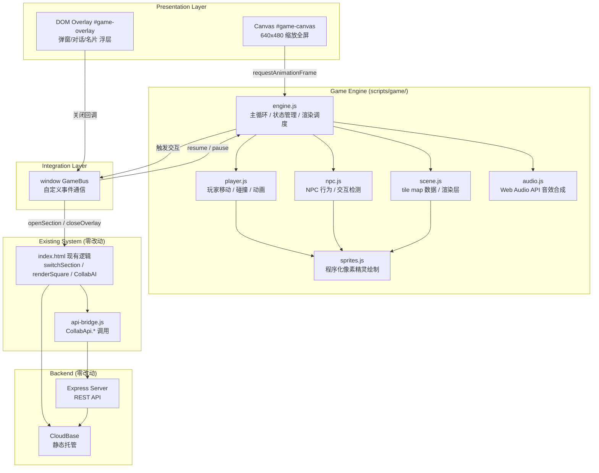

# CollabMatch · 像素风驿站 游戏化外壳 · 技术架构方案

> 版本 v1.0 · 架构师：高见远 · 目标：零后端改动，在现有 SPA 上加一层 Canvas 2D 游戏壳
> 关联文档：`docs/game-prd.md`

---

## 目录

1. [技术选型与理由](#1-技术选型与理由)
2. [游戏引擎架构](#2-游戏引擎架构)
3. [渲染管线](#3-渲染管线)
4. [输入系统](#4-输入系统)
5. [碰撞检测方案](#5-碰撞检测方案)
6. [状态机设计](#6-状态机设计)
7. [DOM Overlay 通信方案](#7-dom-overlay-通信方案)
8. [精灵系统](#8-精灵系统)
9. [场景数据格式](#9-场景数据格式)
10. [音效方案](#10-音效方案)
11. [与现有系统集成](#11-与现有系统集成)
12. [性能预算](#12-性能预算)

---

## 1. 技术选型与理由

### 1.1 自研引擎 vs Phaser/PixiJS

| 维度 | Phaser 3 | PixiJS | 自研轻量引擎 |
|------|----------|--------|-------------|
| 包体积 | ~1.2MB minified | ~500KB minified | ~8KB (5个模块) |
| 首次加载 | 额外 JS 下载 + 解析 | 额外 JS 下载 + 解析 | 内联或极小 script 标签 |
| 学习成本 | 完整文档但 API 庞大 | 中等，偏底层渲染 | 极低，代码就 300 行 |
| 场景管理 | 内置 SceneManager | 需自行实现 | 自建简单状态机 |
| Tile 地图 | 内置 Tilemap + Tiled 导入 | 需插件 | 自建 JSON tile 渲染器 |
| 物理碰撞 | Arcade/Matter.js | 需插件 | 自建 tile-base AABB |
| 依赖性 | 引入外部依赖 | 引入外部依赖 | 零依赖 |

**结论：自研引擎。** 理由：

- 本项目场景固定（1 个室内客栈），不需要 Phaser 的场景管理、粒子系统、补间动画等重型功能
- 像素风 32x32 tile 的渲染只需要 drawImage 循环，不涉及复杂变换
- 避免引入 1MB+ 外部依赖，保持首屏加载 < 200ms（当前 SPA 本身已 ~437KB）
- 自研引擎的总代码量预计 ~300 行（engine.js），维护成本可控
- 如果未来需求扩展到需要 Phaser 级别功能（物理引擎、多场景），迁移路径明确：把 scene.js 的数据格式导出为 Tiled JSON 即可

### 1.2 Tile 地图方案

**方案：自建 JSON tile map + 手工编排。**

不使用 Tiled Editor 的原因：
- 仅 1 个场景（20×15 tile），手工编排 JSON 完全可行
- 避免引入 Tiled 的 XML/JSON 解析库
- 后续可写一个简单的可视化编辑器（P2 需求），但 P0 直接手写坐标

数据结构见 [第 9 节](#9-场景数据格式)。

### 1.3 状态机方案

**方案：有限状态机（FSM）`enum + switch`，不引入 XState 等状态机库。**

- 游戏一共 4 个顶层状态，不需要层级状态机
- enum + switch 在性能、可读性、调试便利性上都优于引入库

详见 [第 6 节](#6-状态机设计)。

### 1.4 整体技术栈表

| 层次 | 技术 | 说明 |
|------|------|------|
| 渲染 | Canvas 2D API (`drawImage`) | 所有像素绘制通过单个 `<canvas>` |
| 动画循环 | `requestAnimationFrame` | 自建 game loop，控制帧率 |
| 精灵/素材 | 程序化绘制 (Canvas 离屏) | 所有角色/物件像素在离屏 canvas 预绘制到 ImageData/ImageBitmap |
| 地图 | 自建 JSON tile 描述 | 20×15 grid，3 层（背景/物件/碰撞） |
| 输入 | DOM `keydown`/`keyup` 事件 | WASD + 方向键，无游戏手柄需求 |
| 音效 | Web Audio API (`OscillatorNode` + `GainNode`) | 纯合成，零外部音频文件 |
| 通信 | `window` 全局事件总线 | Canvas ↔ DOM overlay 通过自定义事件通信 |
| 部署 | CloudBase 静态托管 | 与现有部署完全一致，零后端改动 |

---

## 2. 游戏引擎架构

### 2.1 模块关系图

```
                    ┌──────────────────────┐
                    │     index.html        │
                    │  ┌──────────────────┐ │
                    │  │  <canvas>         │ │
                    │  │  game-canvas      │ │
                    │  └──────┬───────────┘ │
                    │         │             │
                    │  ┌──────┴───────────┐ │
                    │  │  DOM Overlay     │ │
                    │  │  (对话/广场/名片) │ │
                    │  └──────────────────┘ │
                    └──────────────────────┘
                               │
          ┌────────────────────┼────────────────────┐
          │           scripts/game/                  │
          │                                          │
          │  ┌──────────┐    ┌──────────┐           │
          │  │ engine.js│───>│ scene.js │           │
          │  │ (主循环)  │    │ (场景数据)│           │
          │  └────┬─────┘    └──────────┘           │
          │       │                                  │
          │  ┌────┴─────┐    ┌──────────┐           │
          │  │player.js │    │  npc.js   │           │
          │  │(玩家控制) │    │ (NPC逻辑) │           │
          │  └────┬─────┘    └────┬─────┘           │
          │       │               │                  │
          │  ┌────┴───────┐ ┌────┴──────┐           │
          │  │ sprites.js │ │sprites.js │(共用)     │
          │  │ (精灵绘制)  │ │(精灵绘制)  │           │
          │  └────────────┘ └───────────┘           │
          └──────────────────────────────────────────┘
```

### 2.2 类与模块职责

#### engine.js — 游戏主循环 (~150 行)

```
全局职责：
- initGame(canvasId)      初始化 Canvas，加载场景，启动循环
- gameLoop(timestamp)      requestAnimationFrame 回调
- pause/resume()           暂停/恢复游戏循环
- destroy()                销毁引擎，清理资源

内部持有：
- canvas / ctx             Canvas 渲染上下文
- player                   玩家实例 (来自 player.js)
- npcs[]                   NPC 实例数组 (来自 npc.js)
- scene                    场景数据 (来自 scene.js)
- inputState               当前输入状态
- gameState                游戏状态 (枚举)
- lastTimestamp            上一帧时间戳
- accumulator              帧时间累加器 (固定步长用)
- fpsCounter / fps         帧率统计
```

核心循环伪代码：

```js
function gameLoop(timestamp) {
  if (paused) { requestAnimationFrame(gameLoop); return; }

  const dt = Math.min((timestamp - lastTimestamp) / 1000, 0.05); // 上限 50ms 防跳帧
  lastTimestamp = timestamp;

  // 1. 处理输入
  processInput(inputState, dt);

  // 2. 更新游戏逻辑
  if (gameState === GameState.EXPLORE) {
    player.update(dt, scene.collisionMap);
    npcs.forEach(npc => npc.update(dt));
    checkInteractions(player, npcs, scene.interactables);
  }

  // 3. 渲染
  render(ctx, scene, player, npcs);

  // 4. FPS 统计
  updateFPS(timestamp);

  requestAnimationFrame(gameLoop);
}

function render(ctx, scene, player, npcs) {
  ctx.clearRect(0, 0, canvas.width, canvas.height);

  // 分层绘制（见第 3 节）
  renderLayer(ctx, scene.layers.background);
  renderLayer(ctx, scene.layers.objects);
  npcs.forEach(npc => npc.render(ctx));
  player.render(ctx);
  renderLayer(ctx, scene.layers.foreground); // 遮挡层

  // 绘制头顶气泡/交互提示
  renderHUD(ctx, player, npcs);
}
```

#### scene.js — 场景管理 (~80 行)

```
职责：
- 定义 tile map 数据 (硬编码或从 JSON 加载)
- getTile(x, y, layer)   读取指定层指定坐标的 tile
- isWalkable(x, y)       查询碰撞层是否可通行
- getInteractable(x, y)  查询当前坐标是否有交互物件
- renderLayer(ctx, layer) 绘制指定层的所有 tile

数据结构：
{
  width: 20, height: 15, tileSize: 32,
  tileset: { /* tile 定义: id -> {color, pattern, ...} */ },
  layers: {
    background: [[tileId, ...], ...],   // 20x15 二维数组
    objects:    [[tileId, ...], ...],
    collision:  [[0|1, ...], ...],      // 0=可行走, 1=阻挡
  },
  interactables: [
    { x: 8, y: 6, width: 2, height: 1, type: 'board', action: 'openSquare' },
    ...
  ],
  spawnPoint: { x: 10, y: 13 }  // 玩家出生点
}
```

#### player.js — 玩家控制 (~120 行)

```
职责：
- Player 类: { x, y, direction, frame, speed, sprite }
- update(dt, collisionMap)   根据 inputState 移动，碰撞检测，更新动画帧
- render(ctx)                绘制当前精灵帧
- teleport(x, y)             传送到指定坐标 (用于动画)
- 移动速度: 3 tile/s (96px/s)，对角移动归一化

属性：
- direction: 'down' | 'up' | 'left' | 'right'
- state: 'idle' | 'walking'
- animFrame: 0-3 (当前动画帧序号)
- animTimer: 帧计时器 (每 150ms 切一帧)
```

#### npc.js — NPC 逻辑 (~80 行)

```
职责：
- NPC 类: { id, x, y, type, direction, sprite, dialogFlag }
- update(dt)                待机动画 (呼吸/踱步)
- render(ctx)               绘制当前精灵帧
- canInteract(px, py)       判断玩家是否在交互范围内 (2 tile)
- getAction()               返回触发动作名
- 子类/配置区分类型: 'waiter'(小二哥) | 'hero'(匹配侠客)

侠客 NPC 特殊逻辑：
- spawnTimer: 出现倒计时 (默认 30s 后消失)
- matchedUserId: 关联的匹配用户 ID
- 刷新逻辑: 进入场景时检查 API 最新匹配，有则生成 1-2 个
```

#### sprites.js — 精灵动画绘制 (~200 行)

```
职责：
- 程序化像素精灵绘制 (见第 8 节)
- createPlayerSprite()      创建玩家 4 方向 × 2 状态 × 4 帧 的精灵表
- createNPCSprite(type)     创建指定类型 NPC 的精灵表
- createTileSprite(id)      创建 tile 图块 (地面/墙壁/物件)
- getSpriteSheet(sprite)    获取 ImageBitmap 数组供 drawImage 使用

绘制方式：
- 在离屏 OffscreenCanvas (32x32 per frame) 上用 fillRect 逐像素绘制
- 所有帧预渲染为 ImageBitmap[]，游戏循环中直接 drawImage(bitmap, ...)
```

### 2.3 文件结构与依赖顺序

```
index.html 中 <script> 加载顺序：
1. scripts/game/sprites.js   (零依赖)
2. scripts/game/scene.js     (依赖 sprites.js 中的 tile 精灵)
3. scripts/game/player.js    (依赖 sprites.js)
4. scripts/game/npc.js       (依赖 sprites.js)
5. scripts/game/engine.js    (依赖以上全部)
```

### 2.4 技术架构 Mermaid 图



---

## 3. 渲染管线

### 3.1 分层渲染顺序

```
第 0 层: 背景层 (background)
  ├── 地面 tile (木板地/石砖地)
  ├── 墙壁 tile (木墙)
  └── 窗户/装饰

第 1 层: 物件层 (objects)
  ├── 酒桌/长凳
  ├── 告示墙板
  ├── 铜镜台
  ├── 书架
  └── 灯笼/挂饰等静态装饰

第 2 层: NPC 层 (动态角色)
  ├── 小二哥 (排序按 Y 坐标实现伪深度)
  └── 匹配侠客

第 3 层: 玩家层
  └── 玩家角色

第 4 层: 前景层 (foreground)
  └── 遮挡物件 (柱子/横梁/门口帘布)

第 5 层: HUD 层
  ├── 交互提示 ("按 E 对话" 气泡)
  ├── NPC 名字/气泡
  └── 状态指示器 (可选)
```

伪深度排序规则：所有在第 2 层和第 3 层的实体，按 Y 坐标升序排列。Y 坐标越小（越靠北/上）的实体越先绘制，实现"站在后面的人被站在前面的人遮挡"的效果。

```js
// 渲染角色时的排序
const entities = [...npcs, player];
entities.sort((a, b) => a.y - b.y);
entities.forEach(e => e.render(ctx));
```

### 3.2 Canvas 尺寸与缩放策略

**基础分辨率：640 × 480 (20×15 tile × 32px)**

```css
#game-canvas {
  position: fixed;
  top: 0; left: 0;
  width: 100vw;
  height: 100vh;
  z-index: 0;
  image-rendering: pixelated;      /* 保持像素锐利 */
  image-rendering: crisp-edges;    /* Firefox 兼容 */
}
```

Canvas 内部逻辑分辨率始终 640×480，CSS 拉伸到全屏。

缩放实现：

```js
function initCanvas(canvasId) {
  const canvas = document.getElementById(canvasId);
  canvas.width = 640;
  canvas.height = 480;
  canvas.style.imageRendering = 'pixelated';

  // 监听窗口 resize 调整 CSS 缩放比例（可选，保持整数倍缩放）
  window.addEventListener('resize', () => adjustCanvasScale(canvas));
}

function adjustCanvasScale(canvas) {
  // 计算最大整数倍缩放
  const scaleX = Math.floor(window.innerWidth / 640);
  const scaleY = Math.floor(window.innerHeight / 480);
  const scale = Math.max(1, Math.min(scaleX, scaleY));
  canvas.style.width = (640 * scale) + 'px';
  canvas.style.height = (480 * scale) + 'px';
  canvas.style.left = ((window.innerWidth - 640 * scale) / 2) + 'px';
  canvas.style.top = ((window.innerHeight - 480 * scale) / 2) + 'px';
}
```

**两种模式选择：**
- P0 默认：CSS `100vw × 100vh` 拉伸全屏（简单，像素会略有拉伸但 32px tile 下几乎无感）
- P1 可选：整数倍缩放 + 居中 + 黑边（像素完美，但可能有黑边）

### 3.3 摄像机系统

P0 不做摄像机跟随——场景 20×15 正好填满 640×480，无需滚动。
如果 P2 扩展到更大场景（30×30 tile），则增加摄像机偏移：

```js
let camera = { x: 0, y: 0 };

function updateCamera(player) {
  camera.x = player.x - canvas.width / 2 / TILE_SIZE;
  camera.y = player.y - canvas.height / 2 / TILE_SIZE;
  // 限制摄像机不超出场景边界
  camera.x = Math.max(0, Math.min(camera.x, scene.width - canvas.width / TILE_SIZE));
  camera.y = Math.max(0, Math.min(camera.y, scene.height - canvas.height / TILE_SIZE));
}
```

### 3.4 渲染性能优化

```js
// 1. 离屏 Canvas 预渲染静态层
const bgCanvas = new OffscreenCanvas(640, 480);
// 初始化时一次性绘制背景层 + 物件层到 bgCanvas
// 每帧只需要 ctx.drawImage(bgCanvas, 0, 0)

// 2. 脏矩形检测 (P1 可选)
// 仅重绘变化的 tile 区域，避免全屏 clearRect

// 3. ImageBitmap 替代 ImageData
// sprites.js 中所有精灵帧预生成为 ImageBitmap (异步，零拷贝)
// 渲染时 ctx.drawImage(bitmap, x, y) 比 putImageData 快约 3x

async function createSpriteFrames() {
  const frames = [];
  for (let i = 0; i < frameCount; i++) {
    drawFrame(offscreenCtx, i);
    frames.push(await createImageBitmap(offscreenCanvas));
  }
  return frames;
}
```

---

## 4. 输入系统

### 4.1 键盘映射

| 按键 | 动作 | 优先级 |
|------|------|--------|
| W / ArrowUp | 向上移动 | 移动 |
| A / ArrowLeft | 向左移动 | 移动 |
| S / ArrowDown | 向下移动 | 移动 |
| D / ArrowRight | 向右移动 | 移动 |
| E | 交互 | 交互 (最高) |
| Esc | 关闭弹窗 / 返回游戏 | UI |
| Enter | 确认交互弹窗 | UI |

### 4.2 输入缓冲与处理

```js
// engine.js 中的输入管理
const inputState = {
  up: false, down: false, left: false, right: false,
  interact: false,  // E 键按下 (单帧有效)
  interactJustPressed: false,
};

const keyMap = {
  'KeyW': 'up',    'ArrowUp': 'up',
  'KeyA': 'left',  'ArrowLeft': 'left',
  'KeyS': 'down',  'ArrowDown': 'down',
  'KeyD': 'right', 'ArrowRight': 'right',
  'KeyE': 'interact',
};

function setupInput() {
  window.addEventListener('keydown', (e) => {
    const action = keyMap[e.code];
    if (!action) return;

    e.preventDefault(); // 阻止页面滚动、浏览器快捷键

    if (action === 'interact') {
      inputState.interactJustPressed = true;
    } else {
      inputState[action] = true;
    }
  });

  window.addEventListener('keyup', (e) => {
    const action = keyMap[e.code];
    if (!action || action === 'interact') return;

    inputState[action] = false;
  });

  // 窗口失去焦点时重置所有按键
  window.addEventListener('blur', () => {
    Object.keys(inputState).forEach(k => inputState[k] = false);
  });
}
```

### 4.3 E 键交互的特殊处理

E 键交互是**单帧触发**（不是持续按下），需要做边缘检测：

```js
// 在每帧 processInput 中
function processInput(inputState) {
  // E 键边缘检测：只在按下瞬间触发一次
  if (inputState.interactJustPressed) {
    inputState.interactJustPressed = false;
    tryInteract(player, npcs, scene.interactables);
  }
}

function tryInteract(player, npcs, interactables) {
  // 检查 NPC
  for (const npc of npcs) {
    if (npc.canInteract(player.x, player.y)) {
      triggerNPCInteraction(npc);
      return;
    }
  }
  // 检查静态交互点
  for (const obj of interactables) {
    if (isPlayerNear(player, obj)) {
      triggerObjectInteraction(obj);
      return;
    }
  }
}
```

### 4.4 移动平滑处理

```js
// player.js
class Player {
  constructor(spawnX, spawnY) {
    this.x = spawnX;           // tile 坐标（浮点）
    this.y = spawnY;
    this.pixelX = spawnX * 32; // 像素坐标（用于碰撞，可选方式）
    this.pixelY = spawnY * 32;
    this.speed = 3;            // tile/s
    this.direction = 'down';
    this.state = 'idle';
  }

  update(dt, collisionMap) {
    let dx = 0, dy = 0;
    if (inputState.up)    dy -= 1;
    if (inputState.down)  dy += 1;
    if (inputState.left)  dx -= 1;
    if (inputState.right) dx += 1;

    // 对角移动归一化（确保斜走速度与直走一致）
    if (dx !== 0 && dy !== 0) {
      dx *= 0.707;
      dy *= 0.707;
    }

    if (dx !== 0 || dy !== 0) {
      this.state = 'walking';
      this.direction = getDirection(dx, dy);

      // 分轴碰撞检测（滑墙效果）
      const newX = this.x + dx * this.speed * dt;
      const newY = this.y + dy * this.speed * dt;

      if (!isColliding(newX, this.y, collisionMap)) {
        this.x = newX;
      }
      if (!isColliding(this.x, newY, collisionMap)) {
        this.y = newY;
      }

      // 动画帧更新
      this.animTimer += dt;
      if (this.animTimer >= 0.15) {  // 150ms per frame
        this.animTimer -= 0.15;
        this.animFrame = (this.animFrame + 1) % 4;
      }
    } else {
      this.state = 'idle';
      this.animFrame = 0;
      this.animTimer = 0;
    }
  }
}

function getDirection(dx, dy) {
  if (Math.abs(dx) > Math.abs(dy)) return dx > 0 ? 'right' : 'left';
  return dy > 0 ? 'down' : 'up';
}
```

**关键设计决策：**
- 使用 `dt`（delta time）保证不同帧率下移动速度一致
- 分轴碰撞检测：先在 X 轴尝试移动，如果碰撞则保持 X 不变；再在 Y 轴尝试，实现"贴墙滑动"效果
- 对角移动归一化到 0.707 倍速，避免斜走比直走快 41%
- 不使用输入队列或预测，因为不是格斗/动作游戏，不需要精确帧输入

---

## 5. 碰撞检测方案

### 5.1 方案选择：Tile-base AABB

**选择 tile-base 碰撞，不用像素级碰撞。** 理由：

- 场景是 tile-grid 对齐的（32×32），碰撞天然是 tile 级别的
- 玩家/角色大小 < 1 tile（24×32 在 32×32 tile 内），AABB 足够精确
- 像素碰撞在 32×32 低分辨率下无意义，反而增加计算量

### 5.2 碰撞检测算法

#### 基础 tile 碰撞

```js
// scene.js 中的碰撞判断
function isWalkable(tileX, tileY) {
  // 边界检查
  if (tileX < 0 || tileX >= scene.width || tileY < 0 || tileY >= scene.height) {
    return false; // 场景边界外不可行走
  }
  return scene.layers.collision[tileY][tileX] === 0;
}
```

#### 玩家 AABB 碰撞检测

玩家的碰撞体定义为**脚底中心点 + 碰撞半径**：

```js
// 玩家碰撞体: 以脚底中心为中心的 20x12 矩形
function getPlayerBounds(player) {
  return {
    x: player.x * TILE_SIZE + 6,   // 左右各留 6px
    y: player.y * TILE_SIZE + 20,  // 头顶留 20px (脚底区域)
    w: 20, // 碰撞宽度
    h: 12, // 碰撞高度
  };
}

function isColliding(tileX, tileY, collisionMap) {
  // 检查玩家覆盖的 4 个 tile 角
  const bounds = getPlayerBoundsAt(tileX, tileY);
  const left   = Math.floor(bounds.x / TILE_SIZE);
  const right  = Math.floor((bounds.x + bounds.w - 1) / TILE_SIZE);
  const top    = Math.floor(bounds.y / TILE_SIZE);
  const bottom = Math.floor((bounds.y + bounds.h - 1) / TILE_SIZE);

  for (let ty = top; ty <= bottom; ty++) {
    for (let tx = left; tx <= right; tx++) {
      if (!isWalkable(tx, ty)) return true;
    }
  }
  return false;
}
```

#### 分轴移动（滑墙）

这是让角色"贴着墙走"的关键技术：

```js
// 先尝试 X 轴移动
const nextX = player.x + dx * player.speed * dt;
if (!isColliding(nextX, player.y)) {
  player.x = nextX;
}
// 再尝试 Y 轴移动
const nextY = player.y + dy * player.speed * dt;
if (!isColliding(player.x, nextY)) {
  player.y = nextY;
}
```

这样当玩家斜向走向墙角时，先被 X 轴挡住、然后在 Y 轴上滑动，体验自然。

#### NPC 交互距离检测

```js
// npc.js
NPC.prototype.canInteract = function(px, py) {
  // 曼哈顿距离 ≤ 2 tile
  const distX = Math.abs(px - this.x);
  const distY = Math.abs(py - this.y);
  return distX <= 2 && distY <= 2;

  // 如需方向限定（只能从正面交互），加上：
  // && isPlayerFacingNPC(player, this)
};
```

### 5.3 碰撞层数据预览

```
collision map (20×15, 0=可行走, 1=阻挡):
y=0  [1,1,1,1,1,1,1,1,1,1,1,1,1,1,1,1,1,1,1,1]   ← 北墙
y=1  [1,0,0,0,0,0,0,0,0,0,0,0,0,0,0,0,0,0,0,1]
y=2  [1,0,0,0,0,0,0,0,0,0,0,0,0,0,0,0,0,0,0,1]
y=3  [1,0,0,0,0,0,1,1,0,0,1,1,0,0,0,0,0,0,0,1]   ← 酒桌1(6-7), 酒桌2(10-11)
y=4  [1,0,0,0,0,0,1,1,0,0,1,1,0,0,0,0,0,0,0,1]
y=5  [1,0,0,0,0,0,0,0,0,0,0,0,0,0,0,0,0,0,0,1]
y=6  [1,0,0,0,0,0,0,0,1,0,0,0,0,0,0,0,0,0,0,1]   ← 告示墙(8)
y=7  [1,0,0,0,0,0,0,0,0,0,0,0,0,0,0,0,0,0,0,1]
y=8  [1,0,0,0,0,0,0,0,1,0,0,0,0,0,0,0,0,0,0,1]   ← 小二哥 NPC(8)
y=9  [1,0,0,0,0,0,0,0,0,0,0,0,0,0,0,0,0,0,0,1]
y=10 [1,0,0,0,0,0,0,0,0,0,0,0,0,0,0,0,0,0,0,1]
y=11 [1,0,0,0,0,0,0,0,0,0,0,0,0,0,1,0,0,0,0,1]   ← 铜镜(14)
y=12 [1,0,0,0,0,0,0,0,0,0,0,0,0,0,0,0,0,0,0,1]
y=13 [1,0,0,0,0,0,0,0,0,P,0,0,0,0,0,0,0,0,0,1]   ← 入口/出生点 P=(9)
y=14 [1,1,1,1,1,1,1,1,1,0,1,1,1,1,1,1,1,1,1,1]   ← 南墙 (9为入口缺口)
```

---

## 6. 状态机设计

### 6.1 游戏顶层状态

```
┌──────────┐  按E靠近NPC/物件  ┌──────────┐
│          │ ────────────────> │          │
│ EXPLORE  │                    │ DIALOG   │
│ (探索态) │ <──────────────── │ (对话态) │
│          │   关闭弹窗/Esc     │          │
└────┬─────┘                   └──────────┘
     │
     │ 打开菜单 (Tab/P1)
     v
┌──────────┐
│  MENU    │
│ (菜单态) │──── 关闭 ────> EXPLORE
└──────────┘
     ^
     │ 匹配成功动画触发
     │
┌──────────┐
│ ANIMATION│
│ (动画态) │──── 动画结束 ────> EXPLORE
└──────────┘
```

### 6.2 状态定义

```js
// engine.js
const GameState = {
  EXPLORE:   'explore',    // 自由移动
  DIALOG:    'dialog',     // 交互弹窗打开（NPC对话/广场/名片）
  MENU:      'menu',       // 游戏内菜单 (P1)
  ANIMATION: 'animation',  // 播放动画中 (匹配成功等)
};

let gameState = GameState.EXPLORE;
```

### 6.3 状态切换规则

```js
const stateTransitions = {
  [GameState.EXPLORE]: {
    allowedInput: ['move', 'interact'],       // 允许的输入类型
    onEnter() {
      inputState.reset();
      gameLoop.resume();
      hideOverlay();
    },
    actions: {
      interact(target) {
        gameState = GameState.DIALOG;
        gameLoop.pause();
        showOverlay(target);
      },
      openMenu() {
        gameState = GameState.MENU;
        gameLoop.pause();
        showMenu();
      },
    },
  },

  [GameState.DIALOG]: {
    allowedInput: ['ui'],                      // 只允许 UI 输入
    onEnter() { /* 游戏循环已暂停 */ },
    actions: {
      close() {
        hideOverlay();
        gameState = GameState.EXPLORE;
      },
    },
  },

  [GameState.ANIMATION]: {
    allowedInput: [],                           // 动画中不接受任何输入
    onEnter() { inputState.reset(); },
    onComplete() {
      gameState = GameState.EXPLORE;
    },
  },
};
```

### 6.4 各状态下的输入过滤

```js
function processInput(inputState) {
  switch (gameState) {
    case GameState.EXPLORE:
      handleMovement(inputState);
      if (inputState.interactJustPressed) handleInteract();
      break;
    case GameState.DIALOG:
    case GameState.MENU:
      // 不处理游戏输入，所有输入由 DOM overlay 处理
      break;
    case GameState.ANIMATION:
      // 动画中忽略所有输入
      break;
  }
}
```

### 6.5 玩家子状态（PLAYER_STATE）

在 EXPLORE 态的 `player.update()` 内部，玩家还有子状态：

```js
const PlayerState = {
  IDLE:    'idle',      // 静止站立
  WALKING: 'walking',   // 走路动画
};

// 这个子状态由输入自动决定，不需要外部触发：
// 有方向键按下 → WALKING
// 无方向键按下 → IDLE
```

---

## 7. DOM Overlay 通信方案

### 7.1 架构总览

```
┌──────────────────────────────────────────┐
│              Window (全屏)                │
│  ┌────────────────────────────────────┐  │
│  │  Canvas Layer (z-index: 0)          │  │
│  │  #game-canvas                       │  │
│  │  - 场景渲染                          │  │
│  │  - 玩家/NPC 动画                     │  │
│  │  - HUD 交互提示                      │  │
│  └────────────────────────────────────┘  │
│  ┌────────────────────────────────────┐  │
│  │  DOM Overlay Layer (z-index: 10)    │  │
│  │  #game-overlay                      │  │
│  │  - 对话面板 (小二哥→CollabAI)         │  │
│  │  - 需求列表 (告示墙→renderSquare)     │  │
│  │  - 个人名片 (铜镜→renderProfile)      │  │
│  │  - 匹配卡片 (侠客→matchForward)       │  │
│  └────────────────────────────────────┘  │
└──────────────────────────────────────────┘
```

### 7.2 CSS 布局

```css
/* 在 index.html 中新增 */
#game-canvas {
  position: fixed;
  top: 0; left: 0;
  width: 100vw; height: 100vh;
  z-index: 0;
  image-rendering: pixelated;
  display: none; /* 默认隐藏，进入游戏模式时显示 */
}

#game-overlay {
  position: fixed;
  top: 0; left: 0;
  width: 100vw; height: 100vh;
  z-index: 10;
  pointer-events: none; /* 默认不拦截事件 */
  display: none;
}

#game-overlay.active {
  display: flex;
  justify-content: center;
  align-items: center;
  pointer-events: auto; /* 弹窗打开时可交互 */
  background: rgba(0, 0, 0, 0.6); /* 半透明遮罩 */
}

.game-panel {
  background: var(--bg-card);
  border-radius: var(--radius-lg);
  border: 1px solid var(--border);
  max-width: 600px;
  max-height: 80vh;
  overflow-y: auto;
  padding: 24px;
  box-shadow: var(--shadow);
}
```

### 7.3 通信机制：全局事件总线 `GameBus`

不引入 PubSub 库，用原生 `CustomEvent` + `window.dispatchEvent`：

```js
// engine.js 顶部定义
const GameBus = {
  // 游戏→DOM: 触发弹窗打开
  emit(eventName, detail) {
    window.dispatchEvent(new CustomEvent(eventName, { detail }));
  },

  // DOM→游戏: 监听弹窗关闭
  on(eventName, callback) {
    window.addEventListener(eventName, (e) => callback(e.detail));
  },

  off(eventName, callback) {
    window.removeEventListener(eventName, callback);
  },
};
```

### 7.4 完整通信流程

#### 场景 1：走近小二哥 → 打开 AI 对话

```js
// ① engine.js — 玩家按 E 靠近 NPC
function triggerNPCInteraction(npc) {
  if (npc.type === 'waiter') {
    gameState = GameState.DIALOG;
    gameLoop.pause();
    // 通知 DOM 层打开对话面板
    GameBus.emit('game:openDialog', { npc: 'waiter' });
  }
}

// ② index.html 中监听
GameBus.on('game:openDialog', ({ npc }) => {
  const overlay = document.getElementById('game-overlay');
  overlay.classList.add('active');
  // 复用现有 CollabAI 对话逻辑，渲染到 game-overlay 内
  renderChatToOverlay();
});

// ③ 用户关闭对话
function closeGameOverlay() {
  document.getElementById('game-overlay').classList.remove('active');
  // 通知游戏引擎恢复
  GameBus.emit('game:resume');
}
```

#### 场景 2：走进告示墙 → 打开需求广场

```js
// engine.js
function triggerObjectInteraction(obj) {
  if (obj.action === 'openSquare') {
    gameState = GameState.DIALOG;
    gameLoop.pause();
    GameBus.emit('game:openSquare', { action: 'openSquare' });
  }
}

// index.html
GameBus.on('game:openSquare', () => {
  const overlay = document.getElementById('game-overlay');
  overlay.classList.add('active');
  overlay.innerHTML = ''; // 清空
  // 调用现有 renderSquare()，但将输出定向到 overlay
  renderSquareToOverlay();
});
```

#### 场景 3：匹配成功动画 → 自动跳转群组

```js
// engine.js — DIALOG 态中，用户点击"邀请"
GameBus.emit('game:sendInvite', { userId: 'xxx' });

// index.html — 调用现有邀请逻辑
GameBus.on('game:sendInvite', async ({ userId }) => {
  await CollabApi.sendInvite(userId);
  // 匹配成功后
  if (success) {
    closeGameOverlay();
    // 触发入座动画
    GameBus.emit('game:matchSuccess', { partnerId: userId });
  }
});

// engine.js — 播放动画
GameBus.on('game:matchSuccess', ({ partnerId }) => {
  gameState = GameState.ANIMATION;
  playMatchAnimation(player, partnerId, () => {
    // 动画结束后跳转
    gameState = GameState.EXPLORE;
    gameLoop.resume();
    switchSection('groups'); // 调用现有函数切入群组页
  });
});
```

### 7.5 游戏循环暂停/恢复策略

```js
// engine.js
let paused = false;
let animationFrameId = null;

function pause() {
  paused = true;
  inputState.reset(); // 释放所有按键
}

function resume() {
  paused = false;
  lastTimestamp = performance.now(); // 重置时间戳防跳帧
}

// 在 gameLoop 中
function gameLoop(timestamp) {
  animationFrameId = requestAnimationFrame(gameLoop);

  if (paused) {
    // 暂停时仍渲染最后一帧（Canvas 不会被清除）
    // 但也可以选择不渲染，因为 DOM overlay 覆盖在 Canvas 上
    return;
  }

  // ... 正常逻辑
}
```

**为什么要暂停而不是继续渲染？**
- 弹窗打开时，DOM overlay 完全覆盖 Canvas，渲染无意义
- 节省 CPU/GPU 资源（手机/低配机器优先）
- 避免弹窗期间玩家误操作（键盘事件被 overlay 层拦截）

### 7.6 现有函数复用映射表

| 游戏交互 | 触发 | 复用现有函数 | 渲染目标 |
|----------|------|-------------|----------|
| 小二哥对话 | 按 E 靠近 | `switchSection('home')` + CollabAI 对话逻辑 | `#game-overlay` |
| 告示墙 | 按 E 靠近 | `renderSquare()` 中的数据获取+渲染逻辑 | `#game-overlay` |
| 铜镜 | 按 E 靠近 | `renderProfile()` | `#game-overlay` |
| 侠客匹配卡片 | 按 E 靠近 | `matchForward()` / `sendInvite()` | `#game-overlay` |
| 匹配成功动画 | 动画回调 | `switchSection('groups')` | 正常 section 切换 |

这些函数需要在 overlay 模式下做微调：渲染目标从 `#app` 内的 `.section` 改为 `#game-overlay` 内的容器。**不需要修改函数内部逻辑，只需要一个 `renderTarget` 参数或全局标志。**

---

## 8. 精灵系统

### 8.1 程序化绘制方案

全部像素精灵通过 Canvas 离屏绘制，零外部素材。每个精灵帧在 32×32 的离屏 Canvas 上用 `fillRect` 逐像素"画"出来。

**优势：**
- 零外部资源加载，首屏即玩
- 可随时修改配色/尺寸，无需重新出图
- 后续可替换为美术提供的雪碧图（只需改 `sprites.js` 的绘制函数）

### 8.2 4 方向动画帧数据结构

```js
// sprites.js
// 精灵表结构: { direction: { state: [frame0, frame1, frame2, frame3] } }
// 每个 frame 是一个 ImageBitmap

const DIRECTION_FRAMES = 4;  // 每方向 4 帧 (站 1 帧 + 走 3 帧)
const TOTAL_FRAMES = 4 * 2 * 4; // 4方向 × 2状态 × 4帧 = 32 帧

async function createPlayerSprite(colorScheme) {
  const sprite = {
    down:  { idle: [], walk: [] },
    up:    { idle: [], walk: [] },
    left:  { idle: [], walk: [] },
    right: { idle: [], walk: [] },
  };

  const canvas = new OffscreenCanvas(32, 32);
  const ctx = canvas.getContext('2d');

  for (const dir of ['down', 'up', 'left', 'right']) {
    // idle: 第 0 帧
    drawCharacterFrame(ctx, dir, 0, 'idle', colorScheme);
    sprite[dir].idle[0] = await createImageBitmap(canvas);

    // walk: 第 1-3 帧 (循环: 0-1-2-1-0-1-2-1...)
    for (let f = 0; f < 3; f++) {
      drawCharacterFrame(ctx, dir, f, 'walk', colorScheme);
      sprite[dir].walk[f] = await createImageBitmap(canvas);
    }
  }

  return sprite;
}
```

### 8.3 角色像素绘制示例（程序化）

```js
function drawCharacterFrame(ctx, direction, frame, state, colors) {
  ctx.clearRect(0, 0, 32, 32);

  const { skin, hair, top, bottom, shoes } = colors;
  const wobble = state === 'walk' ? WALK_WOBBLE[direction][frame] : 0;

  // === 头部 (8x8, 居中偏上) ===
  ctx.fillStyle = skin;
  ctx.fillRect(12, 2, 8, 8);  // 脸

  ctx.fillStyle = hair;
  ctx.fillRect(11, 0, 10, 3); // 头发
  ctx.fillRect(11, 3, 2, 2);  // 鬓角左
  ctx.fillRect(19, 3, 2, 2);  // 鬓角右

  // === 眼睛 (根据方向) ===
  ctx.fillStyle = '#000';
  if (direction === 'left') {
    ctx.fillRect(12, 4, 1, 2); // 左眼
  } else if (direction === 'right') {
    ctx.fillRect(17, 4, 1, 2); // 右眼
  } else {
    ctx.fillRect(13, 4, 1, 2); // 左
    ctx.fillRect(17, 4, 1, 2); // 右
  }

  // === 身体 (10x10) ===
  ctx.fillStyle = top;
  ctx.fillRect(11, 10, 10, 10);

  // === 手臂 (根据方向 + 帧摆动) ===
  ctx.fillStyle = skin;
  // 走路时手臂前后摆动
  const armSwing = state === 'walk' ? ARM_SWING[direction][frame] : 0;
  ctx.fillRect(9 + armSwing, 11, 2, 6);   // 左臂
  ctx.fillRect(21 - armSwing, 11, 2, 6);  // 右臂

  // === 腿 (根据方向 + 帧跨步) ===
  ctx.fillStyle = bottom;
  if (state === 'walk') {
    const [legL, legR] = LEG_FRAMES[direction][frame];
    ctx.fillRect(11, 20, 4, legL);  // 左腿
    ctx.fillRect(17, 20, 4, legR);  // 右腿
  } else {
    ctx.fillRect(11, 20, 4, 7);     // 站立双腿
    ctx.fillRect(17, 20, 4, 7);
  }

  // === 鞋 ===
  ctx.fillStyle = shoes;
  ctx.fillRect(11, 27, 4, 2);
  ctx.fillRect(17, 27, 4, 2);
}
```

### 8.4 走动画帧摆动数据

```js
// 行走时的身体上下摆动 (像素偏移)
const WALK_WOBBLE = {
  down:  [0, -1, 0,  1],  // 4 帧的 Y 偏移
  up:    [0,  1, 0, -1],
  left:  [0, -1, 0,  1],
  right: [0, -1, 0,  1],
};

// 行走时手臂前后摆动
const ARM_SWING = {
  down:  [0, 1, 0, -1],
  up:    [0, 1, 0, -1],
  left:  [0, 1, 0, -1],
  right: [0, 1, 0, -1],
};

// 行走时腿部跨步长度 [左腿, 右腿]
const LEG_FRAMES = {
  down:  [[6,8], [8,6], [6,8], [7,7]],
  up:    [[6,8], [8,6], [6,8], [7,7]],
  left:  [[6,8], [8,6], [6,8], [7,7]],
  right: [[6,8], [8,6], [6,8], [7,7]],
};
```

### 8.5 NPC 精灵差异

不同类型的 NPC 通过配色方案区分：

```js
const NPC_COLORS = {
  waiter: {      // 小二哥：灰布衣 + 白头巾
    skin: '#f5d0a9',
    hair: '#4a3728',
    top: '#7a8b8b',    // 灰色布衣
    bottom: '#5a6b6b',
    shoes: '#3a3a3a',
    hat: '#e8e0d0',    // 白头巾
  },
  hero: {          // 匹配侠客：随机颜色
    skin: '#f5d0a9',
    hair: '#1a1a2e',
    top: '#4a6fa5',    // 蓝色劲装
    bottom: '#3a5f95',
    shoes: '#2a2a3a',
  },
};

const PLAYER_COLORS = {
  skin: '#ffd8b1',
  hair: '#2a1a0a',
  top: '#8b7bf7',     // 紫色 (accent 色)
  bottom: '#6b5bc7',
  shoes: '#3a3a5a',
};
```

### 8.6 渲染时的帧选择逻辑

```js
// player.js render()
render(ctx) {
  const { direction, state, animFrame } = this;
  let frame;

  if (state === 'idle') {
    frame = this.sprite[direction].idle[0]; // 只用第 0 帧
  } else {
    // walk: 0-1-2-1-0-1-2-1 循环（来回走更自然）
    const walkIndex = [0, 1, 2, 1][animFrame % 4];
    frame = this.sprite[direction].walk[walkIndex];
  }

  const px = Math.round(this.x * TILE_SIZE);
  const py = Math.round(this.y * TILE_SIZE);

  // ImageBitmap 直接 drawImage，无需额外裁剪
  ctx.drawImage(frame, px, py, TILE_SIZE, TILE_SIZE);
}
```

### 8.7 Tile 精灵定义

```js
// sprites.js — 场景 tile 绘制函数
function createTileSprite(type) {
  const canvas = new OffscreenCanvas(32, 32);
  const ctx = canvas.getContext('2d');

  switch (type) {
    case 'floor_wood':
      // 木地板
      ctx.fillStyle = '#8B6914';
      ctx.fillRect(0, 0, 32, 32);
      // 木板纹理
      ctx.fillStyle = '#7A5A10';
      for (let y = 0; y < 32; y += 8) {
        ctx.fillRect(0, y, 32, 1);
      }
      ctx.fillStyle = '#9B7930';
      ctx.fillRect(0, 15, 32, 2); // 中缝
      break;

    case 'wall_wood':
      // 木墙
      ctx.fillStyle = '#5C4033';
      ctx.fillRect(0, 0, 32, 32);
      // 竖木条纹理
      for (let x = 0; x < 32; x += 8) {
        ctx.fillStyle = '#4A3328';
        ctx.fillRect(x, 0, 2, 32);
      }
      break;

    case 'table': /* ... */ break;
    case 'window': /* ... */ break;
    case 'board': /* 告示墙 */ break;
    case 'mirror': /* 铜镜 */ break;
    case 'lantern': /* 灯笼 */ break;
  }

  return canvas.transferToImageBitmap();
}
```

---

## 9. 场景数据格式

### 9.1 Tile Map JSON 结构

```json
{
  "name": "驿站大厅",
  "width": 20,
  "height": 15,
  "tileSize": 32,

  "tileset": {
    "0":  { "type": "floor_wood",  "walkable": true },
    "1":  { "type": "wall_wood",   "walkable": false },
    "2":  { "type": "floor_stone", "walkable": true },
    "3":  { "type": "table",       "walkable": false },
    "4":  { "type": "chair",       "walkable": false },
    "5":  { "type": "window",      "walkable": false },
    "6":  { "type": "door",        "walkable": true },
    "7":  { "type": "board",       "walkable": false },
    "8":  { "type": "mirror",      "walkable": false },
    "9":  { "type": "lantern",     "walkable": true },
    "10": { "type": "bookshelf",   "walkable": false },
    "11": { "type": "counter",     "walkable": false }
  },

  "layers": {
    "background": [
      [1,1,1,1,1,1,1,1,1,1,1,1,1,1,1,1,1,1,1,1],
      [1,0,0,0,0,0,0,0,0,0,0,0,0,0,0,0,0,0,0,1],
      [1,0,0,0,0,0,0,0,0,0,0,0,0,0,0,0,0,0,0,1],
      [1,0,0,0,0,0,0,0,0,0,0,0,0,0,0,0,0,0,0,1],
      [1,0,0,0,0,0,0,0,0,0,0,0,0,0,0,0,0,0,0,1],
      [1,0,0,0,0,0,0,0,0,0,0,0,0,0,0,0,0,0,0,1],
      [1,0,0,0,0,0,0,0,0,0,0,0,0,0,0,0,0,0,0,1],
      [1,0,0,0,2,0,0,0,0,0,0,0,0,0,0,0,0,0,0,1],
      [1,0,0,0,0,0,0,0,0,0,0,0,0,0,0,0,0,0,0,1],
      [1,0,0,0,0,0,0,0,0,0,0,0,0,0,0,0,0,0,0,1],
      [1,0,0,0,0,0,0,0,0,0,0,0,0,0,0,0,0,0,0,1],
      [1,0,0,0,0,0,0,0,0,0,0,0,0,0,0,0,0,0,0,1],
      [1,0,0,0,0,0,0,0,0,0,0,0,0,0,0,0,0,0,0,1],
      [1,0,0,0,0,0,0,0,0,0,0,0,0,0,0,0,0,0,0,1],
      [1,1,1,1,1,1,1,1,1,6,1,1,1,1,1,1,1,1,1,1]
    ],

    "objects": [
      [0,0,0,0,0,0,0,0,0,0,0,0,0,0,0,0,0,0,0,0],
      [0,0,0,0,0,0,0,0,0,0,0,0,0,0,0,0,0,0,0,0],
      [0,0,0,0,0,0,0,0,0,0,0,0,0,0,0,0,0,0,0,0],
      [0,0,0,0,0,0,3,3,0,0,3,3,0,0,0,0,0,0,0,0],
      [0,0,0,0,0,0,4,4,0,0,4,4,0,0,0,0,0,0,0,0],
      [0,0,0,0,0,0,0,0,0,0,0,0,0,0,0,0,0,0,0,0],
      [0,0,0,0,0,0,0,0,7,0,0,0,0,0,0,0,0,0,0,0],
      [0,0,0,0,0,0,0,0,0,0,0,0,0,0,0,0,0,0,0,0],
      [0,0,0,0,0,0,0,0,0,0,0,0,0,0,0,0,0,0,0,0],
      [0,0,0,0,0,0,0,0,0,0,0,0,0,0,0,0,0,0,0,0],
      [0,0,0,0,0,0,0,0,0,0,0,0,0,0,0,0,0,0,0,0],
      [0,0,0,0,0,0,0,0,0,0,0,0,0,0,8,0,0,0,0,0],
      [0,0,0,0,0,0,0,0,0,0,0,0,0,0,0,0,0,0,0,0],
      [0,0,0,0,0,0,0,0,0,0,0,0,0,0,0,0,0,0,0,0],
      [0,0,0,0,0,0,0,0,0,0,0,0,0,0,0,0,0,0,0,0]
    ],

    "collision": [
      [1,1,1,1,1,1,1,1,1,1,1,1,1,1,1,1,1,1,1,1],
      [1,0,0,0,0,0,0,0,0,0,0,0,0,0,0,0,0,0,0,1],
      [1,0,0,0,0,0,0,0,0,0,0,0,0,0,0,0,0,0,0,1],
      [1,0,0,0,0,0,1,1,0,0,1,1,0,0,0,0,0,0,0,1],
      [1,0,0,0,0,0,1,1,0,0,1,1,0,0,0,0,0,0,0,1],
      [1,0,0,0,0,0,0,0,0,0,0,0,0,0,0,0,0,0,0,1],
      [1,0,0,0,0,0,0,0,1,0,0,0,0,0,0,0,0,0,0,1],
      [1,0,0,0,0,0,0,0,0,0,0,0,0,0,0,0,0,0,0,1],
      [1,0,0,0,0,0,0,0,0,0,0,0,0,0,0,0,0,0,0,1],
      [1,0,0,0,0,0,0,0,0,0,0,0,0,0,0,0,0,0,0,1],
      [1,0,0,0,0,0,0,0,0,0,0,0,0,0,0,0,0,0,0,1],
      [1,0,0,0,0,0,0,0,0,0,0,0,0,0,1,0,0,0,0,1],
      [1,0,0,0,0,0,0,0,0,0,0,0,0,0,0,0,0,0,0,1],
      [1,0,0,0,0,0,0,0,0,0,0,0,0,0,0,0,0,0,0,1],
      [1,1,1,1,1,1,1,1,1,0,1,1,1,1,1,1,1,1,1,1]
    ]
  },

  "interactables": [
    {
      "id": "board_wall",
      "type": "board",
      "x": 8, "y": 6,
      "width": 1, "height": 1,
      "action": "openSquare",
      "label": "告示墙"
    },
    {
      "id": "bronze_mirror",
      "type": "mirror",
      "x": 14, "y": 11,
      "width": 1, "height": 1,
      "action": "openProfile",
      "label": "铜镜"
    }
  ],

  "npcs": [
    {
      "id": "waiter_xiaoer",
      "type": "waiter",
      "x": 8, "y": 8,
      "direction": "down",
      "action": "openDialog",
      "label": "小二哥",
      "dialog": "客官有何吩咐？"
    }
  ],

  "spawnPoint": { "x": 9, "y": 13 }
}
```

### 9.2 场景加载流程

```js
// scene.js
async function loadScene(sceneData) {
  // 1. 预渲染所有 tile 精灵
  const tileSprites = {};
  for (const [id, def] of Object.entries(sceneData.tileset)) {
    tileSprites[id] = createTileSprite(def.type);
  }

  // 2. 预渲染背景层到离屏 Canvas (静态，一帧搞定)
  const bgCanvas = new OffscreenCanvas(
    sceneData.width * TILE_SIZE,
    sceneData.height * TILE_SIZE
  );
  const bgCtx = bgCanvas.getContext('2d');
  for (let y = 0; y < sceneData.height; y++) {
    for (let x = 0; x < sceneData.width; x++) {
      const tileId = sceneData.layers.background[y][x];
      if (tileId !== 0) {
        bgCtx.drawImage(tileSprites[tileId], x * TILE_SIZE, y * TILE_SIZE);
      }
    }
  }

  // 3. 同理渲染物件层

  return {
    ...sceneData,
    tileSprites,
    bgImage: bgCanvas,  // 背景层 ImageBitmap
    objImage: objCanvas, // 物件层 ImageBitmap
  };
}
```

### 9.3 编辑方式

- **P0**: 手工编辑 JSON 数组（场景小，可维护）
- **P1**: 写一个简单的 HTML 可视化编辑器（鼠标点击放置 tile，导出 JSON）
- **P2**: 对接 Tiled Editor 导入

---

## 10. 音效方案

### 10.1 Web Audio API 合成方案

全部音效用 `OscillatorNode` + `GainNode` 合成，零音频文件。

```js
// audio.js
const AudioCtx = window.AudioContext || window.webkitAudioContext;
let audioCtx = null;

function initAudio() {
  // 浏览器要求用户交互后才能创建 AudioContext
  audioCtx = new AudioCtx();
}

// ============ 音效生成函数 ============

// 脚步声 — 低频短促的噪声脉冲
function sfxFootstep() {
  if (!audioCtx) return;
  const osc = audioCtx.createOscillator();
  const gain = audioCtx.createGain();
  osc.type = 'triangle';
  osc.frequency.setValueAtTime(80, audioCtx.currentTime);
  osc.frequency.exponentialRampToValueAtTime(40, audioCtx.currentTime + 0.08);
  gain.gain.setValueAtTime(0.15, audioCtx.currentTime);
  gain.gain.exponentialRampToValueAtTime(0.001, audioCtx.currentTime + 0.08);
  osc.connect(gain);
  gain.connect(audioCtx.destination);
  osc.start(audioCtx.currentTime);
  osc.stop(audioCtx.currentTime + 0.08);
}

// 交互提示音 (按E触发) — 清脆短铃
function sfxInteract() {
  if (!audioCtx) return;
  const osc = audioCtx.createOscillator();
  const gain = audioCtx.createGain();
  osc.type = 'sine';
  osc.frequency.setValueAtTime(880, audioCtx.currentTime);
  osc.frequency.exponentialRampToValueAtTime(440, audioCtx.currentTime + 0.15);
  gain.gain.setValueAtTime(0.2, audioCtx.currentTime);
  gain.gain.exponentialRampToValueAtTime(0.001, audioCtx.currentTime + 0.2);
  osc.connect(gain);
  gain.connect(audioCtx.destination);
  osc.start(audioCtx.currentTime);
  osc.stop(audioCtx.currentTime + 0.2);
}

// 打开弹窗音效 — 木门推开/卷轴展开
function sfxOpenPanel() {
  if (!audioCtx) return;
  // 短白噪声爆破 (模拟卷轴展开)
  const bufferSize = audioCtx.sampleRate * 0.2;
  const buffer = audioCtx.createBuffer(1, bufferSize, audioCtx.sampleRate);
  const data = buffer.getChannelData(0);
  for (let i = 0; i < bufferSize; i++) {
    data[i] = (Math.random() * 2 - 1) * (1 - i / bufferSize);
  }
  const source = audioCtx.createBufferSource();
  const gain = audioCtx.createGain();
  source.buffer = buffer;
  gain.gain.setValueAtTime(0.08, audioCtx.currentTime);
  gain.gain.exponentialRampToValueAtTime(0.001, audioCtx.currentTime + 0.2);
  source.connect(gain);
  gain.connect(audioCtx.destination);
  source.start();
}

// 匹配成功 — 上升三音和弦
function sfxMatchSuccess() {
  if (!audioCtx) return;
  const notes = [523, 659, 784]; // C5, E5, G5
  notes.forEach((freq, i) => {
    const osc = audioCtx.createOscillator();
    const gain = audioCtx.createGain();
    osc.type = 'triangle';
    osc.frequency.value = freq;
    gain.gain.setValueAtTime(0, audioCtx.currentTime + i * 0.12);
    gain.gain.linearRampToValueAtTime(0.15, audioCtx.currentTime + i * 0.12 + 0.05);
    gain.gain.exponentialRampToValueAtTime(0.001, audioCtx.currentTime + i * 0.12 + 0.5);
    osc.connect(gain);
    gain.connect(audioCtx.destination);
    osc.start(audioCtx.currentTime + i * 0.12);
    osc.stop(audioCtx.currentTime + i * 0.12 + 0.5);
  });
}
```

### 10.2 音效触发时机

| 事件 | 音效 | 触发条件 |
|------|------|----------|
| 玩家走路 | `sfxFootstep()` | player.state === 'walking'，每 2 帧触发一次 (~200ms 间隔) |
| 靠近交互点 | `sfxInteract()` | 靠近 NPC/物件 2 tile 内，且提示气泡刚出现时 |
| 打开弹窗 | `sfxOpenPanel()` | 按 E 成功触发交互，gameState → DIALOG |
| 匹配成功 | `sfxMatchSuccess()` | 匹配成功动画开始时 |
| 关闭弹窗 | `sfxOpenPanel()` (变体) | 关闭 overlay 时 (音量减半) |

### 10.3 脚步声节流

为防止每帧都触发，用间隔控制：

```js
let lastFootstepTime = 0;
const FOOTSTEP_INTERVAL = 0.2; // 200ms

function updateFootstep(player) {
  if (player.state !== 'walking') return;
  const now = performance.now() / 1000;
  if (now - lastFootstepTime > FOOTSTEP_INTERVAL) {
    sfxFootstep();
    lastFootstepTime = now;
  }
}
```

---

## 11. 与现有系统集成

### 11.1 index.html 改造方案

#### 新增 Canvas 和 Overlay 元素

```html
<!-- 在 <body> 内，#app 之前插入 -->
<canvas id="game-canvas" style="display:none;"></canvas>
<div id="game-overlay" class="game-overlay" style="display:none;">
  <div class="game-panel" id="game-panel-content"></div>
  <button class="game-close-btn" onclick="closeGameOverlay()">
    <i data-lucide="x"></i> 退出
  </button>
</div>
```

#### 新增 CSS 样式

```css
/* 在现有 <style> 块末尾追加 */
#game-canvas {
  position: fixed; top: 0; left: 0;
  width: 100vw; height: 100vh;
  z-index: 0; image-rendering: pixelated;
}

#game-overlay {
  position: fixed; top: 0; left: 0;
  width: 100vw; height: 100vh;
  z-index: 10; display: none;
  justify-content: center; align-items: center;
  background: rgba(0,0,0,0.65);
  backdrop-filter: blur(4px);
  -webkit-backdrop-filter: blur(4px);
}

#game-overlay.active { display: flex; }

.game-panel {
  background: var(--bg-card);
  border-radius: var(--radius-lg);
  border: 1px solid var(--border);
  max-width: 620px; max-height: 80vh;
  overflow-y: auto; padding: 24px;
  box-shadow: var(--shadow);
  color: var(--text-primary);
}

.game-close-btn {
  position: absolute; top: 16px; right: 16px;
  padding: 8px 16px; border-radius: var(--radius-sm);
  background: rgba(255,255,255,0.1); color: var(--text-secondary);
  border: none; cursor: pointer; font-size: 13px;
  display: flex; align-items: center; gap: 6px;
  transition: var(--transition);
}
.game-close-btn:hover { background: rgba(255,255,255,0.2); color: var(--text-primary); }

/* 进入/退出游戏模式按钮 */
#game-mode-toggle {
  position: fixed; top: 12px; right: 12px;
  z-index: 100; padding: 6px 14px;
  font-size: 12px; border-radius: var(--radius-sm);
  background: var(--accent-soft); color: var(--accent);
  border: 1px solid var(--accent); cursor: pointer;
  transition: var(--transition);
}
#game-mode-toggle:hover { background: var(--accent); color: #fff; }
```

#### 新增游戏模式切换函数

```js
let gameModeActive = false;

function enterGameMode() {
  if (!currentUser) {
    showToast('请先登录后再进入驿站', 'warning');
    return;
  }

  gameModeActive = true;

  // 隐藏现有 UI
  document.getElementById('app').style.display = 'none';

  // 显示 Canvas
  const canvas = document.getElementById('game-canvas');
  canvas.style.display = 'block';

  // 显示切换按钮
  document.getElementById('game-mode-toggle').textContent = '退出驿站';
  document.getElementById('game-mode-toggle').onclick = exitGameMode;

  // 初始化游戏引擎
  if (!window.__gameInitialized) {
    initGame('game-canvas');
    window.__gameInitialized = true;
  } else {
    gameLoop.resume();
  }
}

function exitGameMode() {
  gameModeActive = false;
  gameLoop.pause();
  document.getElementById('game-canvas').style.display = 'none';
  document.getElementById('game-overlay').classList.remove('active');
  document.getElementById('app').style.display = 'flex';
  document.getElementById('game-mode-toggle').textContent = '进入驿站';
  document.getElementById('game-mode-toggle').onclick = enterGameMode;
}
```

### 11.2 JS 脚本加载

```html
<!-- 在 </body> 前，现有 <script> 标签之后添加 -->
<script src="scripts/game/sprites.js"></script>
<script src="scripts/game/scene.js"></script>
<script src="scripts/game/player.js"></script>
<script src="scripts/game/npc.js"></script>
<script src="scripts/game/audio.js"></script>
<script src="scripts/game/engine.js"></script>
```

注意：`sprites.js` 必须在最前（被 scene/player/npc 依赖）。

### 11.3 现有函数调用适配

为了避免修改现有函数，采用**渲染目标重定向**模式：

```js
// 在 index.html 中新增
let renderTarget = 'app'; // 'app' | 'game-overlay'

function getContentContainer() {
  if (renderTarget === 'game-overlay') {
    return document.getElementById('game-panel-content');
  }
  return document.querySelector('.section.active');
}

// 在进入游戏模式时设置
function enterGameMode() {
  renderTarget = 'game-overlay';
  // ...
}

function exitGameMode() {
  renderTarget = 'app';
  // ...
}

// overlay 版本的 render 包装函数
function renderSquareToOverlay() {
  const container = getContentContainer();
  CollabApi.getRequirements().then(reqs => {
    container.innerHTML = reqs.map(renderSquareCard).join('');
    lucide.createIcons();
  });
}

function renderProfileToOverlay() {
  const container = getContentContainer();
  // 复用 renderProfile 逻辑，输出到 container
}

function closeGameOverlay() {
  document.getElementById('game-overlay').classList.remove('active');
  document.getElementById('game-panel-content').innerHTML = '';
  renderTarget = 'app';
  GameBus.emit('game:overlayClosed');
}
```

### 11.4 构建/部署不变

- **开发**：`node server/src/index.js` 启动后端，浏览器直接打开 `index.html`
- **部署**：CloudBase 静态托管，`index.html` + `scripts/` + `api-bridge.js` 一起上传
- **零新增依赖**：不引入任何 npm 包，不修改 `package.json`
- **文件改动清单**：

| 文件 | 操作 | 说明 |
|------|------|------|
| `index.html` | 修改 | 新增 Canvas + overlay + CSS + 切换逻辑 |
| `scripts/game/sprites.js` | 新建 | 精灵绘制 |
| `scripts/game/scene.js` | 新建 | 场景数据 + 渲染 |
| `scripts/game/player.js` | 新建 | 玩家类 |
| `scripts/game/npc.js` | 新建 | NPC 类 |
| `scripts/game/audio.js` | 新建 | Web Audio 音效 |
| `scripts/game/engine.js` | 新建 | 游戏主循环 |
| 后端所有文件 | 不改 | 零改动 |
| `api-bridge.js` | 不改 | 零改动 |

---

## 12. 性能预算

### 12.1 目标指标

| 指标 | 目标值 | 测量方式 |
|------|--------|----------|
| 帧率 (FPS) | 稳定 60fps (桌面) / 30fps (低配设备) | `requestAnimationFrame` 回调间隔统计 |
| 主循环耗时 | < 8ms/frame (留 8ms 给浏览器渲染) | `performance.now()` 差值 |
| 内存占用 (游戏层) | < 10MB | Chrome DevTools Memory 面板 |
| 首屏加载增量 | < 50ms (< 15KB gzip 的 JS 增量) | Lighthouse / Performance API |
| 游戏 JS 总大小 | < 15KB minified (6 个文件合计) | 文件大小统计 |
| Canvas 显存 | < 4MB (640*480*4 ≈ 1.2MB + 精灵缓存) | 估算 |
| 首次交互时间 | 进入场景后 < 500ms 可操作 | 手动计时 |

### 12.2 帧预算分配

```
每帧 16.67ms (60fps) 预算分配：
┌──────────────────────────────────────┐
│ 输入处理          < 0.5ms             │
│ 玩家更新          < 0.5ms             │
│ NPC 更新          < 0.3ms             │
│ 碰撞检测          < 0.3ms             │
│ 交互检测          < 0.2ms             │
│ 渲染 (drawImage)  < 4ms               │
│ HUD 渲染          < 0.5ms             │
│ ──────────────────────────────────── │
│ 合计预算          < 8ms               │
│ 剩余给浏览器       > 8ms               │
└──────────────────────────────────────┘
```

### 12.3 优化策略

#### 当前（P0）即可满足

- 静态层预渲染到 OffscreenCanvas（背景+物件层只画一次）
- ImageBitmap 零拷贝渲染
- 场景小（20×15 tile = 300 个 tile，每层 300 次 drawImage，约 0.5ms）
- 最多 3 个 NPC + 1 个玩家（4 个精灵，每人 1 次 drawImage）

#### 如果出现性能问题

1. **降低逻辑分辨率**：从 640×480 降到 480×360（缩小 75%），CSS 拉伸
2. **降低动画帧率**：玩家动画降到 6fps（每 3 帧更新一次精灵帧）
3. **移除 HUD 渲染**：交互提示改为 DOM 元素而非 Canvas 绘制
4. **requestAnimationFrame 节流**：目标 30fps 而非 60fps

### 12.4 监控代码

```js
// engine.js 中的 FPS 计数器
let fpsFrames = 0;
let fpsTime = 0;
let currentFPS = 60;

function updateFPS(timestamp) {
  fpsFrames++;
  if (timestamp - fpsTime >= 1000) {
    currentFPS = Math.round(fpsFrames / ((timestamp - fpsTime) / 1000));
    fpsFrames = 0;
    fpsTime = timestamp;

    // 开发模式下打印帧率（可关闭）
    if (window.__DEBUG_GAME__) {
      console.log(`FPS: ${currentFPS}, Frame time: ${(1000/currentFPS).toFixed(1)}ms`);
    }
  }
}
```

---

## 附录 A：开发排期建议（P0 最小可玩）

| 阶段 | 任务 | 估时 | 产出物 |
|------|------|------|--------|
| 1 | sprites.js — tile 精灵 + 角色精灵绘制 | 1 天 | 可跑的程序化精灵 |
| 2 | scene.js — 场景数据 + 分层渲染 | 1 天 | 静态场景可见 |
| 3 | player.js — 移动 + 碰撞 + 动画 | 1 天 | 角色可走动 |
| 4 | engine.js — 主循环 + 输入系统 | 0.5 天 | 完整游戏循环 |
| 5 | npc.js + 交互检测 | 0.5 天 | 按 E 可触发事件 |
| 6 | DOM overlay 通信 | 1 天 | 弹窗打开/关闭流程 |
| 7 | index.html 集成 | 0.5 天 | 切换逻辑 + CSS |
| 8 | audio.js — 音效合成 | 0.5 天 | 走路声/交互声 |
| 9 | 联调 + 修复 | 1 天 | 完整 P0 功能 |
| **合计** | | **7 天** | 最小可玩版本 |

## 附录 B：关键风险与缓解

| 风险 | 概率 | 影响 | 缓解措施 |
|------|------|------|----------|
| Canvas 像素绘制效果不佳，看起来粗糙 | 中 | 视觉体验差 | 提前做几个 tile 和角色帧的 demo 确认风格 |
| 程序化精灵绘制工作量超预期 | 中 | 排期延迟 | 先做 2 方向（上下），左右翻转复用 |
| 移动端键盘不可用 | 高 | 移动用户无法操作 | P0 限定桌面端，P1 补虚拟摇杆 |
| 游戏循环与 DOM 弹窗的 Esc 键冲突 | 低 | UX 困扰 | 分层事件处理，overlay 打开时拦截键盘 |
| 现有函数不能直接复用到 overlay | 中 | 需要重构 | 采用 renderTarget 重定向，修改量小 |

---

*架构方案 v1.0 · 高见远 · 下一步：与产品经理确认场景细节后进入开发*

---

> **关键原则重申：后端零改动、零外部依赖、渐进增强、P0 先做桌面端。**
