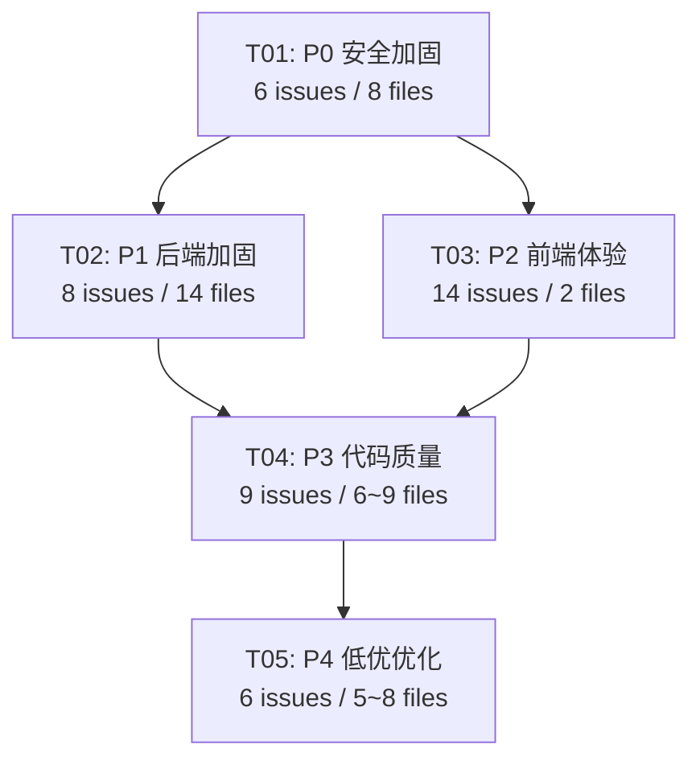
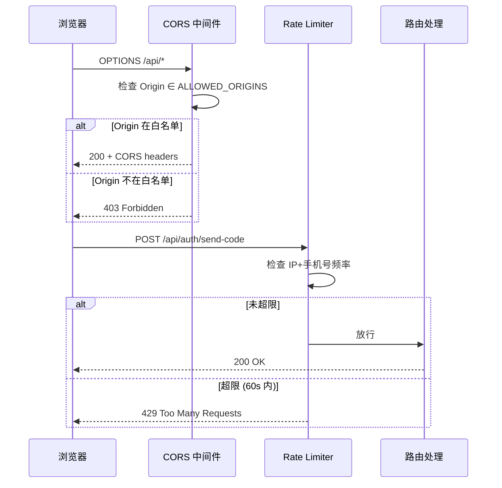

# CollabMatch 修复任务分解

> 基于审查报告 36 个问题的修复任务分解 | 架构师：Bob

---

## Part A: 修复设计概述

### 1. 修复策略

本次修复覆盖 5 个优先级层级（P0→P4），共 36 个问题。核心修复原则：

- **安全性优先**：P0 级 XSS 和认证问题必须最先修复，因为它们直接影响用户数据安全
- **数据完整性紧随其后**：P1 级输入校验、错误泄露、业务逻辑漏洞在安全地基上修复
- **体验问题分批处理**：P2 视觉/UX 问题集中在单文件前端，可在安全修复后独立进行
- **质量与优化收尾**：P3/P4 代码质量和低优优化最后处理，不影响核心功能

### 2. 受影响文件总览

| 层级 | 源文件数 | 关键文件 |
|------|---------|----------|
| 前端 | 2 | `index.html`, `api-bridge.js` |
| 后端路由 | 15 | `server/src/routes/*.ts` |
| 后端中间件 | 2 | `server/src/middleware/auth.ts`, `server/src/middleware/error.ts` |
| 后端服务 | 14 | `server/src/services/*.ts` |
| 后端模型 | 10 | `server/src/models/*.ts` |
| 后端工具 | 5 | `server/src/utils/*.ts` |
| 后端配置 | 4 | `server/src/config/*.ts` |
| 后端入口 | 2 | `server/src/app.ts`, `server/src/index.ts` |
| 云函数 | 1 | `cloudfunctions/collabmatch-api/index.js` |

### 3. 关键架构决策

- **XSS 防护统一化**：将 `escapeHtml` 升级为支持单引号转义，并在 `api-bridge.js` 中集中导出，`index.html` 中所有渲染点统一调用
- **输入校验中间件**：新增 `server/src/middleware/validate.ts`，基于 JSON Schema 对关键路由进行入参校验
- **CORS 白名单化**：在 `server/src/config/domains.ts` 中配置允许的源列表
- **频率限制**：在 `server/src/middleware/` 中新增 rate-limit 中间件，优先保护 `/auth/*` 路由

---

## Part B: 任务分解

### 4. 依赖包清单

后端需新增的依赖：

```
- express-rate-limit@^7.1.0: 频率限制中间件
- joi@^17.11.0: 输入校验 schema 定义
- helmet@^7.1.0: HTTP 安全头（可选增强）
```

---

### 5. 任务列表

#### T01: P0 安全加固（基础设施级）

| 字段 | 内容 |
|------|------|
| **Task ID** | T01 |
| **Priority** | P0（阻塞所有后续任务） |
| **问题覆盖** | C-01, C-02, C-03, C-04, C-05, C-06 |

**涉及文件**：

| 文件路径 | 修改内容 |
|----------|----------|
| `server/src/app.ts` | C-01: 替换 `cors({ origin: true })` 为白名单模式，引入 `domains.ts` 配置 |
| `server/src/config/domains.ts` | C-01: 新增/修改 CORS 白名单常量 |
| `index.html` | C-02: `renderConvList()` 中 `lastMsg` 改用 `textContent` 或先 `escapeHtml`；C-03: `renderGroupMessage()` 中 `fileName` 的 `onclick` 属性注入改用 `addEventListener` + 数据集；C-04: 快捷操作 chips 的 `onclick` 注入改用事件委托 |
| `api-bridge.js` | C-02/C-03/C-04 依赖：升级 `escapeHtml` 函数，新增单引号转义（`'` → `&#39;`），并导出供 `index.html` 使用 |
| `server/src/utils/serialize.ts` | C-05: `toUserJson()` 中移除 `phone` 字段输出 |
| `cloudfunctions/collabmatch-api/index.js` | C-06: 移除硬编码验证码，改为随机生成 + 频率限制 |
| `server/src/routes/auth.ts` | C-06: 发送验证码接口增加频率限制（同一手机号 60s 内仅一次） |
| `server/src/middleware/` | C-06: 新增 `rateLimit.ts` 中间件（如项目尚无），或直接在 auth 路由中使用 `express-rate-limit` |

**预计修改文件数：8 个**

---

#### T02: P1 后端加固与数据完整性

| 字段 | 内容 |
|------|------|
| **Task ID** | T02 |
| **Priority** | P1 |
| **依赖** | T01（escapeHtml 升级、CORS 白名单必须先完成） |
| **问题覆盖** | H-01, H-02, H-03, H-04, H-05, H-06, H-07, H-08 |

**涉及文件**：

| 文件路径 | 修改内容 |
|----------|----------|
| `api-bridge.js` | H-01: 确认 `escapeHtml` 已升级（T01 完成），补充单引号 `'` → `&#39;` 转义（若 T01 未完整覆盖） |
| `server/src/middleware/error.ts` | H-02: 区分开发/生产环境，生产环境仅返回通用 `{ code, message }`，隐藏 stack trace 和内部错误详情 |
| `server/src/middleware/validate.ts` | H-03: **新建** 输入校验中间件，使用 joi schema 校验 `req.body` / `req.query` / `req.params` |
| `server/src/routes/auth.ts` | H-03: 为登录/注册/验证码接口添加 joi schema 校验 |
| `server/src/routes/users.ts` | H-03: 为用户更新接口添加 joi schema 校验；H-08: 添加 author/owner 空值守卫 |
| `server/src/routes/match.ts` | H-03: 为匹配接口添加 joi schema 校验；H-05: 限制 `matchProgress` 字段仅允许服务端计算更新，禁止客户端通过 PUT 直接写入 |
| `server/src/routes/groups.ts` | H-03: 为群组创建/更新接口添加 joi schema 校验；H-08: 添加 author 空值守卫 |
| `server/src/routes/conversations.ts` | H-03: 为会话消息接口添加 joi schema 校验；H-06: 添加消息数组最大长度限制（建议 200 条），超限时拒绝或裁剪 |
| `server/src/routes/requirements.ts` | H-03: 为需求接口添加 joi schema 校验；H-08: 添加 author 空值守卫 |
| `server/src/routes/skills.ts` | H-03: 为技能接口添加 joi schema 校验 |
| `server/src/services/match.ts` | H-04: `filterSquare()` 改为操作局部副本，不再覆盖全局 `REQUIREMENTS` 常量 |
| `server/src/services/skillMarket.ts` | H-07: `installFeaturedSkill()` 添加持久化写入（数据库或文件），确保重启不丢失 |
| `server/src/models/Conversation.ts` | H-06: 在数据模型层添加消息数组长度约束 |

**预计修改文件数：14 个**

---

#### T03: P2 前端视觉与交互体验修复

| 字段 | 内容 |
|------|------|
| **Task ID** | T03 |
| **Priority** | P2 |
| **依赖** | T01（escapeHtml 升级确保安全渲染） |
| **问题覆盖** | V-01~V-07, UX-01~UX-07（共 14 个问题） |

**涉及文件**：

| 文件路径 | 修改内容 |
|----------|----------|
| `index.html` | **视觉修复 (V-01~V-07)**：V-01 统一昵称显示逻辑；V-02 修复消息重复渲染（去重或清理状态）；V-03 AI 消息头像修正；V-04 Profile 编辑态保存后刷新显示；V-05 登录遮罩 z-index 和关闭逻辑；V-06 卡片风格统一（圆角/阴影/间距）；V-07 按钮风格统一（颜色/大小/hover 态） |
| `index.html` | **UX 修复 (UX-01~UX-07)**：UX-01 发送消息添加 loading/成功反馈；UX-02 空状态页面添加引导文案和 CTA；UX-03 筛选操作添加 loading 指示器；UX-04 向导流程添加步骤指示器（1/3, 2/3...）；UX-05 下拉框默认值修正（placeholder 或合理默认项）；UX-06 导航命名规范化；UX-07 Workflow 入口显示条件修正 |
| `api-bridge.js` | UX-01: 发送消息 API 调用返回 Promise 状态供 UI 层消费 |

**预计修改文件数：2 个**（`index.html` 为单文件前端，所有视觉/UX 修改集中于此）

---

#### T04: P3 中优先级代码质量修复

| 字段 | 内容 |
|------|------|
| **Task ID** | T04 |
| **Priority** | P3 |
| **依赖** | T01, T02（安全与数据完整性为基础） |
| **问题覆盖** | M-01~M-09（共 9 个问题） |

**涉及文件**：

| 文件路径 | 修改内容 |
|----------|----------|
| `server/src/services/match.ts` | 匹配服务逻辑优化（具体依 M 类问题详情） |
| `server/src/services/llm.ts` | LLM 调用错误处理、超时配置 |
| `server/src/services/skillRunner.ts` | 技能执行器健壮性改进 |
| `server/src/routes/match.ts` | 匹配路由错误码规范化 |
| `server/src/routes/users.ts` | 用户路由边界条件处理 |
| `server/src/utils/serialize.ts` | 序列化工具类型安全改进 |
| `server/src/models/User.ts` | 模型字段默认值/约束完善 |
| `cloudfunctions/collabmatch-api/index.js` | 云函数错误处理改进 |
| `index.html` | 前端 JS 代码组织优化（若涉及） |

**预计修改文件数：6~9 个**

---

#### T05: P4 低优先级优化

| 字段 | 内容 |
|------|------|
| **Task ID** | T05 |
| **Priority** | P4（可延后） |
| **依赖** | T01, T02, T03, T04 |
| **问题覆盖** | L-01~L-06（共 6 个问题） |

**涉及文件**：

| 文件路径 | 修改内容 |
|----------|----------|
| `server/src/config/env.ts` | 环境变量类型定义、文档注释完善 |
| `server/src/config/skills.ts` | 技能配置结构优化 |
| `server/src/config/workflows.ts` | 工作流配置结构优化 |
| `server/src/services/seed.ts` | 种子数据清理/更新 |
| `server/src/utils/jwt.ts` | JWT 过期策略优化 |
| `index.html` | 前端性能优化（懒加载、事件节流等，若涉及） |
| `server/tsconfig.json` | TypeScript 严格模式检查 |
| `server/package.json` | 依赖版本锁定/清理未使用依赖 |

**预计修改文件数：5~8 个**

---

### 6. 任务依赖关系

```
T01 (P0 安全)
 ├── T02 (P1 后端加固) ── 依赖 T01 的 escapeHtml + CORS
 ├── T03 (P2 前端体验) ── 依赖 T01 的 escapeHtml
 │    └── T04 (P3 代码质量) ── 依赖 T01 + T02
 │         └── T05 (P4 低优优化) ── 依赖 T01 + T02 + T03 + T04
 └── (T03 可与 T02 并行)
```

### 7. 实现顺序建议

```
阶段 1: T01（安全地基）         ← 立即开始，阻塞所有
阶段 2: T02 + T03 并行          ← T02 后端 + T03 前端可同时进行
阶段 3: T04（代码质量）         ← T02 完成后开始
阶段 4: T05（低优收尾）         ← 所有前序完成后
```

**关键路径**：T01 → T02 → T04 → T05（后端链路最长）

### 8. 各优先级组文件修改统计

| 优先级 | 任务ID | 问题数 | 预计修改文件数 | 新建文件 |
|--------|--------|--------|---------------|----------|
| P0 | T01 | 6 | 8 | 1 (`rateLimit.ts`) |
| P1 | T02 | 8 | 14 | 1 (`validate.ts`) |
| P2 | T03 | 14 | 2 | 0 |
| P3 | T04 | 9 | 6~9 | 0 |
| P4 | T05 | 6 | 5~8 | 0 |
| **合计** | — | **36** | **35~41** | **2** |

### 9. 共享知识 (Shared Knowledge)

```
- 所有 API 响应统一使用 { code: number, data: any, message: string } 格式
- 错误中间件生产环境不暴露 stack trace，仅返回 code + message
- 输入校验使用 joi schema，校验失败返回 400 + 具体字段错误信息
- XSS 防护：所有用户生成内容在插入 DOM 前必须通过 escapeHtml() 转义
  - escapeHtml 转义集：& < > " ' （含单引号）
- CORS 白名单从 server/src/config/domains.ts 的 ALLOWED_ORIGINS 读取
- 频率限制：验证码接口同一 IP/手机号 60s 内最多 1 次
- 消息数组上限：200 条/会话，超限时裁剪最早的消息
- 敏感字段（phone）在序列化时一律排除
```

---

## 附：Mermaid 图表

### 任务依赖图



### XSS 修复调用流（关键修复）

```mermaid
sequenceDiagram
    participant API as api-bridge.js
    participant DOM as index.html (render)
    participant User as User Input

    Note over API: escapeHtml() 升级<br/>新增 ' → &#39;

    User->>DOM: 发送消息 / 创建群组
    DOM->>API: 调用 escapeHtml(userInput)
    API-->>DOM: 返回转义后的安全字符串
    DOM->>DOM: textContent 赋值 或<br/>安全 innerHTML
    Note over DOM: C-02/C-03/C-04 修复点<br/>不再直接拼接 innerHTML

    User->>DOM: 点击快捷操作 chip
    DOM->>DOM: 事件委托处理<br/>(不再用 onclick 属性注入)
```



### CORS + 频率限制 修复流


