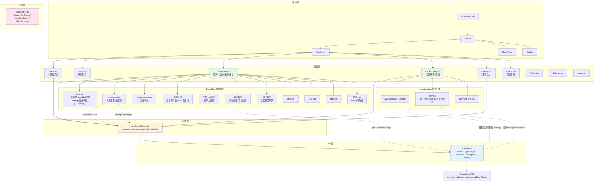

# TrailMate 徒步流程架构设计

> 架构师：高见远（Gao）  
> 日期：2026-06-13  
> 目标：审查「组队聊天 → 出发 → 征途 → 完成」闭环的架构实现

---

## 1. 架构审查

### 1.1 整体评价

**当前架构合理，核心闭环基本实现。** 代码结构清晰，分层得当：

| 层级 | 路径 | 评价 |
|------|------|------|
| 类型层 | `src/types/index.ts` | `hikeStatus`、`checkin.photos/notes` 已添加，类型完备 |
| API 层 | `src/api/index.ts` | 全部所需 API 已封装（update/checkin/generateFromGroup/leave） |
| 状态层 | `src/store/index.ts` | Zustand 全局 store，简洁有效，`showToast` 通过 CustomEvent 跨组件 |
| 页面层 | `src/pages/TeamChat.tsx` | 出发/征途/完成三态完整实现 |
| 页面层 | `src/pages/LocationMap.tsx` | 签到弹窗替代 alert，照片+备注+日志生成 |
| 页面层 | `src/pages/HikeLog.tsx` | 展开详情显示 groupId + 坐标 |
| 页面层 | `src/pages/Notices.tsx` | UserPlus 图标导入修复 |

### 1.2 架构亮点

1. **hikeStatus 三态模型简洁** — `idle → hiking → completed`，与 PRD 一致
2. **出发仪式设计合理** — 无打卡点引导（Modal A） → 打卡点列表确认 → 3-2-1 倒计时 → hiking
3. **进度条联动** — `checkedInCount/totalCheckpoints` 基于 `user?.id` 筛选本地签到状态，无需额外 API
4. **签到 → 自动日志** — doCheckin 中直接调用 `traillogsApi.create()`，闭环完整
5. **队员退出 + 迭代匹配** — leave → dissolvePreview → iterate 流水线
6. **匹配 Tab hiking 时隐藏** — `pageTab === 'match'` 过滤逻辑，防止征途中匹配干扰

### 1.3 发现的问题/风险点

#### 🔴 严重：React 闭包陷阱（TeamChat.tsx:197-218）

```tsx
// 当前代码（有问题）
useEffect(() => {
  if (countdown === null && showGoModal && group) {
    const doGo = async () => {
      // uses id, showGoModal, group, loadGroup...
    };
    const t = setTimeout(doGo, 600);
    return () => clearTimeout(t);
  }
}, [countdown]); // ⚠️ 依赖数组不完整！
```

**问题**：`useEffect` 依赖数组只有 `[countdown]`，但回调中使用了 `showGoModal`、`group`、`id`、`loadGroup`。当这些值在 countdown 期间变化时，effect 读取的是过时的闭包值。

**风险**：倒计时结束后可能用过期 group 状态操作 API，导致 hikeStatus 更新到错误的状态。

**修复**：使用 `useRef` 保存最新值，或将完整的出发逻辑提取到 `startCountdown` 的回调中。

#### 🟡 中等：countdown 双重 setInterval 竞态

```tsx
const startCountdown = () => {
  setCountdown(3);
  const timer = setInterval(() => { ... }, 800);
  // ⚠️ timer 没有保存到 ref，无法清理
};
```

**问题**：如果用户快速双击"开始征途"，会创建两个 setInterval，倒计时数字会跳跃。

**修复**：使用 `useRef` 保存 timer 句柄，`startCountdown` 开始时先清理前一个 timer。

#### 🟡 中等：LocationMap loadLocations 与 checkpoints 乐观更新不一致

`handleMapLongPress`（line 446-457）直接 `setCheckpoints(newCheckpoints)`，但 `loadLocations`（15s 轮询）也会覆盖 checkpoints。如果 API 写入后 15s 内轮询未返回新数据，可能短暂回退。

**修复**：长按设置打卡点后，在 `loadLocations` 的下次调用前不覆盖 checkpoints。可使用乐观更新 + 版本号机制。

#### 🟡 中等：doCheckin 中的 `checkpoints` 闭包值

```tsx
const doCheckin = useCallback(async () => {
  // ...
  const newCheckpoints = [...checkpoints]; // ⚠️ checkpoints 是闭包值
  // ...
}, [id, currentCheckpoint, checkpoints, checkinNote, checkinPhotos, user, groupName, showToast]);
```

虽然列在 deps 中，但如果 15s 轮询在签到过程中更新了 `checkpoints`，`doCheckin` 会基于旧的 checkpoints 构建 `newCheckpoints`，然后覆盖服务器数据。

**修复**：签到前先 `loadLocations()` 获取最新数据，或改为增量更新（只更新当前打卡点，不覆盖整个数组）。

#### 🟢 低：TeamChat 轮询未清理 loadGroup 函数引用

```tsx
useEffect(() => {
  loadGroup();
  pollRef.current = window.setInterval(loadGroup, 3000);
  return () => clearInterval(pollRef.current);
}, [id]);
```

`loadGroup` 在每次渲染时重新创建，但 setInterval 捕获的是首次渲染的版本。由于 `loadGroup` 只使用 `id`（来自 params），且 `id` 变化时 effect 会重建 interval，**实际影响不大**，但不符合 React 最佳实践。

#### 🟢 低：多个模态框同时可见缺乏互斥

当前有 5 个模态/弹窗：`showGoModal`、`showNoCheckpointModal`、`showCompleteModal`、`showLeaveModal`、`showPromptsConfirm`，没有统一的模态管理器。正常使用中不会同时出现，但如果状态管理出错可能同时渲染多个背景遮罩。

---

## 2. 组件关系图（Mermaid）



### 2.1 数据流说明

```
用户操作 → 页面组件(TeamChat/LocationMap) → API(update/checkin/generateFromGroup)
                                                      ↓
                                              CloudBase 后端
                                                      ↓
                   ← loadGroup()/loadLocations() 轮询更新 ←
                                                      ↓
                                           useStore (Zustand) / 本地 useState
```

关键数据流：

1. **出发**：Header(出发按钮) → GoModal(3-2-1) → API.update({ hikeStatus: 'hiking' }) → loadGroup() → HikingBanner 显示
2. **签到**：MemberFlags(点小旗) → CheckinModal(照片+备注) → API.checkin() + API.update({ checkpoints }) + traillogsApi.create() → loadLocations()
3. **完成**：Header(完成按钮) → CompleteModal → API.update({ hikeStatus: 'completed' }) + traillogsApi.generateFromGroup() → CompletedBanner 显示
4. **退出**：队员退出按钮 → LeaveModal → API.leave() + intentApi.dissolvePreview() + intentApi.iterate() → navigate('/teams')

---

## 3. 状态机设计

### 3.1 hikeStatus 三态状态机

```
                    ┌─────────────────────────────────┐
                    │                                 │
                    ▼                                 │
              ┌──────────┐   队长点击出发          ┌───┴──────┐
    初始化 ──▶│   idle   │──────────────────────▶│  hiking   │
              └──────────┘   3-2-1倒计时后        └────┬─────┘
                    ▲         update(hikeStatus:         │
                    │         'hiking')                  │ 队长点击完成
                    │                                   │ update(hikeStatus:
                    │         ┌──────────────────┐      │ 'completed')
                    │         │  队员退出(队长)   │      │
                    │         │  leave API        │      ▼
                    │         └──────────────────┘ ┌────────────┐
                    │                              │ completed  │
                    └──────────────────────────────└────────────┘
                          generateFromGroup          凯旋状态
                          自动生成日志               (终态)
```

### 3.2 状态转换规则与边界条件

| 转换 | 触发条件 | 前置检查 | 副作用 |
|------|---------|---------|--------|
| `idle → hiking` | 队长点击"出发" → 3-2-1 倒计时结束 | 1. 当前用户是队长（`m.role === 'leader'`）<br/>2. 至少 1 个打卡点（无则弹窗引导）<br/>3. hikeStatus === 'idle' | Header 隐藏出发按钮，显示完成按钮<br/>HikingBanner 绿条显示<br/>匹配 Tab 隐藏<br/>全局 matchingEnabled 建议关闭 |
| `hiking → completed` | 队长点击"完成" → 确认弹窗 | 1. 当前用户是队长<br/>2. hikeStatus === 'hiking' | CompletedBanner 凯旋横幅显示<br/>traillogsApi.generateFromGroup() 自动生成日志<br/>队员可退出（不再触发迭代匹配） |
| `hiking → idle` | ❌ 不允许 | — | 不可逆 |
| `completed → hiking` | ❌ 不允许 | — | 终态，不可逆 |
| `completed → idle` | ❌ 不允许（当前实现） | — | 如需重新出发，需要考虑是否新建 Group |

### 3.3 队员退出状态约束

| hikeStatus | 队员能否退出 | 退出后行为 |
|-----------|------------|-----------|
| `idle` | ✅ 可以 | 队长直接退出；队员弹窗 → leave() → dissolvePreview() → iterate() → navigate('/teams') |
| `hiking` | ✅ 非队长可以（队长不在 hiking 中退出） | 同 idle，触发迭代匹配 |
| `completed` | ✅ 可以 | 直接 leave()，不触发迭代匹配（活动已结束） |

### 3.4 接口幂等性要求

- `groupsApi.update(id, { hikeStatus: 'hiking' })` — 如果已是 hiking，应幂等返回 ok
- `groupsApi.update(id, { hikeStatus: 'completed' })` — 如果已是 completed，应幂等返回 ok
- `traillogsApi.generateFromGroup(id)` — 如果已生成过日志，应跳过重复生成
- `groupsApi.checkin(id, cpIndex, lat, lng)` — 如果已签到该打卡点，应更新 checkin 记录而非重复插入

---

## 4. 增量任务列表

### 4.1 符号说明

- ✅ **已完成** — 代码已实现，构建通过
- ⚠️ **需审查/修复** — 代码已实现但存在风险点
- 🔲 **待实现** — 尚未实现
- ❌ **已废弃** — 旧代码已清理

### 4.2 任务清单

#### T-01: 核心类型扩展
| 状态 | 任务 | 详情 | 文件 |
|------|------|------|------|
| ✅ | Group.hikeStatus 添加 | `'idle' \| 'hiking' \| 'completed'` | `src/types/index.ts:105` |
| ✅ | checkin 扩展 photos/notes | `photos?: string[]; notes?: string` | `src/types/index.ts:124` |

#### T-02: TeamChat 出发流程
| 状态 | 任务 | 详情 | 依赖 |
|------|------|------|------|
| ✅ | Header 三态按钮 | idle→出发按钮；hiking→完成按钮；completed→凯旋横幅 | — |
| ✅ | 无打卡点引导弹窗 | 弹窗 + "去设置" 跳转 LocationMap | — |
| ✅ | 出发确认弹窗 | 打卡点列表 + "开始征途"按钮 | — |
| ✅ | 3-2-1 倒计时 | 数字动画 + 800ms 间隔 + "出发！" | — |
| ⚠️ | 倒计时竞态修复 | **P0**：防止双击启动两个 setInterval，修复 useEffect 依赖闭包 | T-02 |
| ⚠️ | 倒计时后 API 调用 | **P0**：修复 useEffect 依赖数组 `[countdown]` → 使用 ref 或完整 deps | T-02 |

#### T-03: TeamChat 征途态
| 状态 | 任务 | 详情 | 依赖 |
|------|------|------|------|
| ✅ | HikingBanner | 绿色渐变 + Mountain 图标 + checkedInCount/totalCheckpoints | — |
| ✅ | 进度条 | `(checkedInCount / totalCheckpoints) * 100%` | — |
| ✅ | 匹配 Tab 隐藏 | hiking 时从 tabs 数组中过滤掉 match | — |
| ✅ | 匹配关闭提示 | 蓝色提示条 "征途进行中，匹配已关闭" | — |
| ✅ | 完成按钮显示 | hiking + 队长 → Flag 图标 "完成" 按钮 | — |

#### T-04: TeamChat 完成流程
| 状态 | 任务 | 详情 | 依赖 |
|------|------|------|------|
| ✅ | 完成确认弹窗 | 三栏摘要（打卡点/已签到/照片） | — |
| ✅ | 自动生成日志 | `traillogsApi.generateFromGroup(id)` | — |
| ✅ | CompletedBanner | 凯旋横幅 "凯旋而归 · 共计 N 个打卡点" | — |
| ✅ | hikeStatus 更新 | `groupsApi.update(id, { hikeStatus: 'completed' })` | — |

#### T-05: 队员退出 + 迭代匹配
| 状态 | 任务 | 详情 | 依赖 |
|------|------|------|------|
| ✅ | 队员退出按钮 | LogOut 图标，hiking 时非队长可退出 | — |
| ✅ | 退出确认弹窗 | "系统将自动为你找到更合适的队友" | — |
| ✅ | leave → dissolvePreview → iterate | 退出后触发迭代匹配 | — |
| ✅ | 队长退出 | alert 确认后直接 leave() | — |

#### T-06: LocationMap 签到
| 状态 | 任务 | 详情 | 依赖 |
|------|------|------|------|
| ✅ | 签到弹窗替代 alert | 完整弹窗：备注 textarea + 照片上传(最多3张) + 打卡按钮 | — |
| ✅ | 照片上传 | FileReader → base64 → usersApi.uploadImage → URL | — |
| ✅ | 签到后更新 checkpoints | 更新当前打卡点 checkins 数组（含 photos/notes） | — |
| ✅ | 签到后自动创建 TrailLog | `traillogsApi.create({ title, type, date, location, notes, photos, groupId })` | — |
| ✅ | showToast 解构 | 从 `useStore` 解构 `showToast` | — |
| ⚠️ | 签到并发安全 | **P1**：doCheckin 使用 `checkpoints` 闭包可能导致数据覆盖，建议先 loadLocations 再构建 newCheckpoints | T-06 |

#### T-07: HikeLog 扩展
| 状态 | 任务 | 详情 | 依赖 |
|------|------|------|------|
| ✅ | 展开详情 groupId 标签 | Users 图标 + "组队记录" 标签 | — |
| ✅ | 坐标显示 | location 含 `,` 时格式化为坐标 | — |

#### T-08: 已废弃代码清理（PRD P0-7）
| 状态 | 任务 | 详情 | 文件 |
|------|------|------|------|
| ✅ | 移除旧 AI 解散 4 阶段 UI | PreviewResult/DissolveResult 类型已移除 | TeamChat.tsx |
| 🔲 | 确认无残留引用 | 全局搜索 `PreviewResult`、`DissolveResult`、`Dissolve` 旧逻辑 | 全项目 |

#### T-09: PRD Q1-Q7 开放问题
| 状态 | 任务 | 详情 |
|------|------|------|
| 🔲 | Q1: hiking 时队长退出怎么办 | 当前实现：队长不在 hiking 时显示退出按钮，但需确认是否转移队长 |
| 🔲 | Q2: completed 后能否重新出发 | 当前 hikeStatus 终态不可逆，需确认产品策略 |
| 🔲 | Q3: 打卡点签到距离阈值 | 当前由后端 checkin API 判断距离，需确认阈值（如 100m） |
| 🔲 | Q4: 签到照片存储上限 | 当前 3 张，是否考虑压缩/缩略图策略 |
| 🔲 | Q5: 自动生成日志的内容策略 | generateFromGroup 后端决定，需确认日志字段填充逻辑 |
| 🔲 | Q6: 队长查看进度全景 | US-5，当前通过 checkedInCount 进度条实现，是否需额外视图 |
| 🔲 | Q7: 迭代匹配的时效和次数限制 | 队员退出后 iterate() 是否应有冷却时间或次数上限 |

#### T-10: 风险修复（P0）
| 状态 | 任务 | 详情 | 优先级 |
|------|------|------|--------|
| 🔲 | 修复倒计时 useEffect 闭包陷阱 | 使用 useRef 保存 showGoModal/group/id，或重构为命令式 | P0 |
| 🔲 | 防止 startCountdown 双重调用 | 添加 isCountingDown ref 互斥锁 | P0 |
| 🔲 | 修复 doCheckin checkpoints 竞态 | 签到前先 loadLocations() 获取最新数据 | P0 |

#### T-11: 质量改进（P1）
| 状态 | 任务 | 详情 | 优先级 |
|------|------|------|--------|
| 🔲 | 添加模态互斥管理 | 统一 Modal 状态，防止多个模态同时渲染 | P1 |
| 🔲 | 添加错误边界 | 防止单个页面崩溃导致白屏 | P1 |
| 🔲 | hiking 时自动关闭 matchingEnabled | 征途中自动将 matchingEnabled 设为 false | P1 |
| 🔲 | 轮询优化 | loadGroup 使用 useCallback 稳定引用，或在 interval 中调用最新版 | P2 |
| 🔲 | 签到距离提示优化 | 当前使用 alert/toast 显示距离，可考虑在弹窗中实时显示 | P2 |

#### T-12: 类型与构建
| 状态 | 任务 | 详情 |
|------|------|------|
| ✅ | tsc --noEmit 零错误 | TypeScript 类型检查通过 |
| ✅ | vite build 成功 | 构建输出 3.75s |
| ✅ | Notices.tsx UserPlus 导入修复 | 补充缺失图标导入 |
| 🔲 | ESLint 检查 | 建议运行 `npx eslint src/` 检查潜在问题 |

---

## 5. 待明确事项（需产品经理确认）

### 5.1 状态转换边界

| # | 问题 | 当前行为 | 需确认 |
|---|------|---------|--------|
| 1 | **hiking 时队长能否退出** | 当前 hiking 时队长不显示退出按钮 | 确认是否正确？队长遇急事需要退出怎么办？是否应先转移队长？ |
| 2 | **completed 后能否重新出发** | hikeStatus 终态不可逆 | 如果需要同一个 Group 再次出发？还是必须创建新 Group？ |
| 3 | **idle 状态下的 completed 横幅** | completed 横幅永久显示 | 是否需要在 N 天后自动隐藏或折叠？ |

### 5.2 签到策略

| # | 问题 | 当前行为 | 需确认 |
|---|------|---------|--------|
| 4 | **签到距离阈值** | 后端 `groupsApi.checkin()` 判断，前端只传坐标 | 阈值是多少米？（建议 100m）是否可配置？ |
| 5 | **重复签到行为** | 当前 doCheckin 可对同一打卡点多次签到（覆盖） | 应该覆盖旧记录还是追加？覆盖的话是否保留旧照片？ |
| 6 | **非队员能否签到** | 当前 `isMember` 检查，分享链接访客不能签到 | 是否需要紧急联系人签到能力？ |

### 5.3 日志生成

| # | 问题 | 当前行为 | 需确认 |
|---|------|---------|--------|
| 7 | **generateFromGroup 日志内容** | 后端决定生成策略 | 日志中应包含哪些信息？（距离、时长、打卡照片、聊天摘要？） |
| 8 | **签到自动日志 vs 完成批量日志** | 签到生成单条日志 + 完成时批量生成 | 两条日志是否会重复？需要去重逻辑吗？ |
| 9 | **非队员日志** | 分享链接访客是否可以查看日志？ | 日志可见性策略？ |

### 5.4 队员退出

| # | 问题 | 当前行为 | 需确认 |
|---|------|---------|--------|
| 10 | **迭代匹配冷却** | 队员退出后立即 iterate() | 是否需要冷却时间？频繁退出/匹配可能造成匹配风暴 |
| 11 | **hiking 中退出是否合理** | 非队长 hiking 时可退出 | hiking 中退出意味着中途离队，是否应该有限制（如不能退出直到完成）？ |
| 12 | **队长退出后队伍** | 队长退出走 leave()，队伍可能缺少队长 | 是否应自动转移队长给第一个队员？还是解散队伍？ |

### 5.5 UI/UX

| # | 问题 | 当前行为 | 需确认 |
|---|------|---------|--------|
| 13 | **队长查看进度全景（US-5）** | 当前通过进度条 + 签到情况头像实现 | 是否需要独立的全景视图（如时间线/地图轨迹叠加签到点）？ |
| 14 | **出发倒计时动画** | 当前 `animate-ping-once` 缩放动画 | 是否需要音效？是否需要全屏倒计时体验？ |
| 15 | **完成弹窗数据** | 三栏：打卡点数/已签数/照片数 | 是否需要增加总时长、总距离等更多数据？ |

---

## 6. 实现优先级建议

```
P0（阻塞上线）
├── T-10-1: 修复倒计时 useEffect 闭包陷阱
├── T-10-2: 防止 startCountdown 双重调用
└── T-10-3: 修复 doCheckin checkpoints 竞态

P1（质量保障）
├── T-11-1: 添加模态互斥管理
├── T-11-2: 添加错误边界
├── T-11-3: hiking 时自动关闭 matchingEnabled
└── T-06-L1: 签到并发安全优化

P2（体验优化 + PM 确认后）
├── T-09: Q1-Q7 开放问题
├── T-11-4: 轮询引用优化
├── T-11-5: 签到距离提示优化
└── T-08: 确认无残留引用

P3（待 PM 确认）
└── 第 5 节 15 个待确认问题
```

---

## 附录 A：文件修改清单

| 文件 | 修改内容 | 状态 |
|------|---------|------|
| `src/types/index.ts` | Group.hikeStatus、checkin photos/notes | ✅ |
| `src/pages/TeamChat.tsx` | 出发/征途/完成全线重构 | ✅ |
| `src/pages/LocationMap.tsx` | 签到弹窗替代 alert | ✅ |
| `src/pages/HikeLog.tsx` | groupId 标签 + 坐标显示 | ✅ |
| `src/pages/Notices.tsx` | UserPlus 图标导入修复 | ✅ |
| `src/api/index.ts` | API 已全部可用（无需修改） | ✅ |

## 附录 B：技术债务

| 项目 | 严重度 | 说明 |
|------|--------|------|
| `TeamChat.tsx` 1200+ 行 | 中 | 建议拆分为独立组件文件（HikingBanner、GoModal、CompleteModal、LeaveModal 等） |
| `LocationMap.tsx` 850 行 | 中 | 建议拆分 CheckinModal、MapLongPress 等子组件 |
| 多个 `any` 类型使用 | 低 | 如 `hikeStatus: 'hiking' as any`，建议完善 Group 类型定义 |
| CustomEvent toast 通信 | 低 | 功能正常但非 React 惯用模式，可考虑 zustand slice |
